# Data Model & DB Stores — Deep Analysis

> **Sub-agent 4 of 4** — Sensei OS Taiga-like System Analysis Pipeline
>
> Preceded by: Kanban & Obeya (1), Tasks & State Machines (2), Saved Views & Search (3)

---

## Table of Contents

1. [Executive Summary](#1-executive-summary)
2. [Complete Entity Catalog](#2-complete-entity-catalog)
3. [EntityStore\<T\> Persistence Pattern Deep Dive](#3-entitystoret-persistence-pattern-deep-dive)
4. [AppState Wiring Analysis](#4-appstate-wiring-analysis)
5. [Rust vs Python/SQLAlchemy Model Comparison](#5-rust-vs-pythonsqlalchemy-model-comparison)
6. [Relational Integrity Analysis](#6-relational-integrity-analysis)
7. [Gaps & Anti-Patterns](#7-gaps--anti-patterns)
8. [Mermaid ER Diagram](#8-mermaid-er-diagram)
9. [Key Recommendations](#9-key-recommendations)

---

## 1. Executive Summary

The Sensei OS Rust backend implements a **generic document-store persistence layer** via [`EntityStore<T>`](sensei-rs/crates/sensei-api/src/db_stores.rs:87), where every domain entity is serialized as a JSONB blob into a single `entity_store` table. This is in stark contrast to the Python/SQLAlchemy reference model ([`BACKEND_DATA_MODELS_MAP.md`](docs/BACKEND_DATA_MODELS_MAP.md)), which defines ~200+ normalised tables with proper foreign keys, composite indexes, partitioning, and vector embeddings. The Rust approach prioritises **development speed and schema flexibility** over relational integrity, but introduces significant operational risks at scale.

**Key finding:** The `entity_store` table referenced by the Rust persistence layer (`INSERT INTO entity_store ...`) has **no `CREATE TABLE` statement** in [`postgres-init/01-init.sql`](postgres-init/01-init.sql:1). This means either the table is created programmatically at runtime (not visible in the codebase scanned) or the database persistence path would fail on first write. This is a **critical gap** that must be resolved before production deployment.

The architecture uses a **dual-mode storage** pattern — in-memory `HashMap<Uuid, T>` for development/testing, PostgreSQL JSONB for production — swapped via [`AppState::with_db_pool()`](sensei-rs/crates/sensei-api/src/state.rs:399). The [`StoreWriteGuard`](sensei-rs/crates/sensei-api/src/db_stores.rs:193) "drop-persist" pattern with `tokio::spawn` provides fire-and-forget persistence, but lacks transactional guarantees and error-recovery mechanisms.

**30+ entity types** are defined in [`stores.rs`](sensei-rs/crates/sensei-api/src/stores.rs:1) as Rust structs, separate from the core domain entities in [`entities.rs`](sensei-rs/crates/sensei-core/src/domain/entities.rs:1). This dual-entity definition creates a maintainability burden and potential for drift between the API layer and domain layer.

---

## 2. Complete Entity Catalog

### 2.1 Stores Layer Entities (`stores.rs`)

All entities below are defined in [`sensei-rs/crates/sensei-api/src/stores.rs`](sensei-rs/crates/sensei-api/src/stores.rs:1) and are persisted via `EntityStore<T>`.

| # | Struct | Line | Fields | FK Gaps | String-Enums |
|---|--------|------|--------|---------|-------------|
| 1 | [`KanbanBoard`](sensei-rs/crates/sensei-api/src/stores.rs:23) | 23 | `id: Uuid, tenant_id: Uuid, title: String, description: String, columns: Vec<KanbanColumn>, created_at, updated_at` | `tenant_id` not enforced as FK | `board_type: String`, `status: String` |
| 2 | [`KanbanColumn`](sensei-rs/crates/sensei-api/src/stores.rs:36) | 36 | `id: Uuid, name: String, wip_limit: i32, position: i32, cards: Vec<KanbanCard>` | Embedded in KanbanBoard — no independent FK | — |
| 3 | [`KanbanCard`](sensei-rs/crates/sensei-api/src/stores.rs:49) | 49 | `id: Uuid, title: String, description: String, assigned_to: Option<Uuid>, priority: String, tags: Vec<String>, due_date: Option<i64>, created_at, updated_at` | `assigned_to` not enforced as FK to users | `priority: String`, `card_type: String` |
| 4 | [`Notification`](sensei-rs/crates/sensei-api/src/stores.rs:71) | 71 | `id: Uuid, tenant_id: Uuid, user_id: Uuid, title, message, is_read: bool, created_at` | `user_id`, `tenant_id` not enforced as FK | `notification_type: String` |
| 5 | [`NotificationPreferences`](sensei-rs/crates/sensei-api/src/stores.rs:86) | 86 | `id: Uuid, user_id: Uuid, email_notifications: bool, push_notifications: bool, digest_frequency: String` | `user_id` not enforced as FK | `digest_frequency: String` |
| 6 | [`Attachment`](sensei-rs/crates/sensei-api/src/stores.rs:109) | 109 | `id: Uuid, tenant_id: Uuid, file_name, file_size: i64, mime_type, storage_path, uploaded_by: Uuid, created_at` | `uploaded_by`, `tenant_id` not enforced as FK | — |
| 7 | [`QuoteVersion`](sensei-rs/crates/sensei-api/src/stores.rs:132) | 132 | `id: Uuid, quote_id: Uuid, version_number: i32, data: serde_json::Value, created_by: Uuid, created_at` | `quote_id`, `created_by` not enforced as FK | — |
| 8 | [`LearningModule`](sensei-rs/crates/sensei-api/src/stores.rs:149) | 149 | `id: Uuid, tenant_id: Uuid, title, description, content_type, content_url, duration_minutes: i32, created_at, updated_at` | `tenant_id` not enforced as FK | `content_type: String`, `status: String` |
| 9 | [`Opportunity`](sensei-rs/crates/sensei-api/src/stores.rs:171) | 171 | `id: Uuid, tenant_id: Uuid, title, description, account_id: Uuid, amount: f64, currency, probability: f64, expected_close_date: i64, assigned_to: Option<Uuid>, created_at, updated_at` | `account_id`, `assigned_to`, `tenant_id` not enforced as FK | `stage: String`, `status: String`, `priority: String` |
| 10 | [`EscalationRule`](sensei-rs/crates/sensei-api/src/stores.rs:197) | 197 | `id: Uuid, policy_id: Uuid, condition_field, condition_operator, condition_value, escalate_to_role, escalate_to_user: Option<Uuid>, timeout_minutes: i32, created_at` | `policy_id`, `escalate_to_user` not enforced as FK | `condition_operator: String` |
| 11 | [`EscalationPolicy`](sensei-rs/crates/sensei-api/src/stores.rs:208) | 208 | `id: Uuid, tenant_id: Uuid, name, description, rules: Vec<EscalationRule>, is_active: bool, created_at, updated_at` | `tenant_id` not enforced as FK | — |
| 12 | [`TrainingMatrixEntry`](sensei-rs/crates/sensei-api/src/stores.rs:228) | 228 | `id: Uuid, tenant_id: Uuid, user_id: Uuid, skill_id: Uuid, proficiency_level, certification_expiry: Option<i64>, last_assessed: Option<i64>, created_at, updated_at` | `user_id`, `skill_id`, `tenant_id` not enforced as FK | `proficiency_level: String` |
| 13 | [`KnowledgePack`](sensei-rs/crates/sensei-api/src/stores.rs:252) | 252 | `id: Uuid, tenant_id: Uuid, title, description, content: Vec<u8>, content_type, tags: Vec<String>, version: i32, created_at, updated_at` | `tenant_id` not enforced as FK | `content_type: String`, `status: String` |
| 14 | [`IngestionJob`](sensei-rs/crates/sensei-api/src/stores.rs:284) | 284 | `id: Uuid, tenant_id: Uuid, file_name, file_size: i64, status: IngestionStatus, error_message: Option<String>, created_at, completed_at: Option<i64>` | `tenant_id` not enforced as FK | `status` uses proper enum [`IngestionStatus`](sensei-rs/crates/sensei-api/src/stores.rs:275) |
| 15 | [`WorkCenter`](sensei-rs/crates/sensei-api/src/stores.rs:309) | 309 | `id: Uuid, tenant_id: Uuid, name, description, location, capacity_per_shift: f64, efficiency: f64, created_at, updated_at` | `tenant_id` not enforced as FK | `work_center_type: String`, `status: String` |
| 16 | [`ObeyaBoard`](sensei-rs/crates/sensei-api/src/stores.rs:337) | 337 | `id: Uuid, tenant_id: Uuid, title, description, items: Vec<ObeyaItem>, created_at, updated_at` | `tenant_id` not enforced as FK | `board_type: String`, `status: String` |
| 17 | [`ObeyaItem`](sensei-rs/crates/sensei-api/src/stores.rs:354) | 354 | `id: Uuid, obeya_board_id: Uuid, title, description, related_entity_type, related_entity_id: Uuid, position: i32, created_at, updated_at` | `obeya_board_id` not enforced as FK | `item_type: String`, `related_entity_type: String`, `status: String` |
| 18 | [`CtqCharacteristic`](sensei-rs/crates/sensei-api/src/stores.rs:378) | 378 | `id: Uuid, name, description, unit, target_value: f64, usl: f64, lsl: f64, created_at, updated_at` | No FK fields | — |
| 19 | [`CtqRecord`](sensei-rs/crates/sensei-api/src/stores.rs:397) | 397 | `id: Uuid, ctq_id: Uuid, measured_value: f64, measured_by: Uuid, notes, measured_at: i64, created_at` | `ctq_id`, `measured_by` not enforced as FK | — |
| 20 | [`InventoryItem`](sensei-rs/crates/sensei-api/src/stores.rs:420) | 420 | `id: Uuid, tenant_id: Uuid, product_id: Uuid, warehouse_id: Uuid, quantity_on_hand: f64, quantity_reserved: f64, reorder_point: f64, created_at, updated_at` | `product_id`, `warehouse_id`, `tenant_id` not enforced as FK | — |
| 21 | [`StockMove`](sensei-rs/crates/sensei-api/src/stores.rs:443) | 443 | `id: Uuid, tenant_id: Uuid, product_id: Uuid, from_location: Option<Uuid>, to_location: Option<Uuid>, quantity: f64, reference_type, reference_id: Option<Uuid>, created_by: Uuid, created_at` | `product_id`, `created_by`, `tenant_id` not enforced as FK | `move_type: String`, `reference_type: String` |
| 22 | [`Warehouse`](sensei-rs/crates/sensei-api/src/stores.rs:459) | 459 | `id: Uuid, tenant_id: Uuid, name, location, capacity: f64, created_at, updated_at` | `tenant_id` not enforced as FK | `warehouse_type: String`, `status: String` |
| 23 | [`DemandEntry`](sensei-rs/crates/sensei-api/src/stores.rs:484) | 484 | `id: Uuid, tenant_id: Uuid, product_id: Uuid, quantity: f64, demand_date: i64, source, created_at` | `product_id`, `tenant_id` not enforced as FK | `demand_type: String`, `status: String` |
| 24 | [`SupplyOrder`](sensei-rs/crates/sensei-api/src/stores.rs:501) | 501 | `id: Uuid, tenant_id: Uuid, product_id: Uuid, quantity: f64, order_date: i64, expected_date: i64, created_at` | `product_id`, `tenant_id` not enforced as FK | `order_type: String`, `status: String` |
| 25 | [`MrpRun`](sensei-rs/crates/sensei-api/src/stores.rs:518) | 518 | `id: Uuid, tenant_id: Uuid, demand_entries: Vec<DemandEntry>, supply_orders: Vec<SupplyOrder>, run_date: i64, created_at` | `tenant_id` not enforced as FK | `status: String` |
| 26 | [`Task`](sensei-rs/crates/sensei-api/src/stores.rs:542) | 542 | `id: Uuid, tenant_id: Uuid, title, description, assigned_to: Option<Uuid>, due_date: Option<i64>, related_entity_type: Option<String>, related_entity_id: Option<Uuid>, created_by: Uuid, created_at, updated_at` | `assigned_to`, `created_by`, `tenant_id` not enforced as FK | `status: String`, `priority: String`, `task_type: String`, `related_entity_type: Option<String>` |
| 27 | [`AuditLogEntry`](sensei-rs/crates/sensei-api/src/stores.rs:567) | 567 | `id: Uuid, tenant_id: Uuid, user_id: Uuid, action, entity_type, entity_id: Uuid, changes: Option<serde_json::Value>, ip_address, created_at` | `user_id`, `tenant_id` not enforced as FK | `action: String`, `entity_type: String` |
| 28 | [`ProductionCell`](sensei-rs/crates/sensei-api/src/stores.rs:587) | 587 | `id: Uuid, tenant_id: Uuid, name, description, work_centers: Vec<Uuid>, created_at, updated_at` | `tenant_id` not enforced as FK | `cell_type: String`, `status: String` |
| 29 | [`SavedView`](sensei-rs/crates/sensei-api/src/stores.rs:612) | 612 | `id: Uuid, tenant_id: Uuid, user_id: Uuid, name, filters: serde_json::Value, columns: Vec<String>, sort_by, sort_order: String, created_at, updated_at` | `user_id`, `tenant_id` not enforced as FK | `view_type: String`, `sort_order: String`, `visibility: String` |
| 30 | [`WorkPacket`](sensei-rs/crates/sensei-api/src/stores.rs:642) | 642 | `id: Uuid, work_order_id: Uuid, operations: Vec<WorkPacketOperation>, status, created_at, updated_at` | `work_order_id` not enforced as FK | `status: String` |
| 31 | [`WorkPacketOperation`](sensei-rs/crates/sensei-api/src/stores.rs:659) | 659 | `id: Uuid, operation_code, description, work_center_id: Uuid, setup_time: f64, run_time: f64, sequence: i32` | `work_center_id` not enforced as FK | — |
| 32 | [`CostBuild`](sensei-rs/crates/sensei-api/src/stores.rs:669) | 669 | `id: Uuid, product_id: Uuid, material_cost: f64, labor_cost: f64, overhead_cost: f64, total_cost: f64, currency, effective_date: i64, created_by: Uuid, created_at` | `product_id`, `created_by` not enforced as FK | `cost_type: String`, `status: String` |
| 33 | [`NpiConversion`](sensei-rs/crates/sensei-api/src/stores.rs:690) | 690 | `id: Uuid, product_id: Uuid, from_status, to_status, converted_by: Uuid, notes, converted_at: i64` | `product_id`, `converted_by` not enforced as FK | `from_status: String`, `to_status: String` |
| 34 | [`KpiDefinition`](sensei-rs/crates/sensei-api/src/stores.rs:732) | 732 | `id: Uuid, tenant_id: Uuid, name, description, category: KpiCategory, direction: KpiDirection, target: f64, unit, formula, created_at, updated_at` | `tenant_id` not enforced as FK | Uses proper enums [`KpiCategory`](sensei-rs/crates/sensei-api/src/stores.rs:711), [`KpiDirection`](sensei-rs/crates/sensei-api/src/stores.rs:724) |
| 35 | [`KpiValue`](sensei-rs/crates/sensei-api/src/stores.rs:753) | 753 | `id: Uuid, kpi_id: Uuid, value: f64, recorded_at: i64, recorded_by: Uuid` | `kpi_id`, `recorded_by` not enforced as FK | — |
| 36 | [`LswStandard`](sensei-rs/crates/sensei-api/src/stores.rs:791) | 791 | `id: Uuid, tenant_id: Uuid, title, description, items: Vec<LswChecklistItem>, frequency: LswFrequency, created_at, updated_at` | `tenant_id` not enforced as FK | Uses proper enum [`LswFrequency`](sensei-rs/crates/sensei-api/src/stores.rs:773) |
| 37 | [`LswChecklistItem`](sensei-rs/crates/sensei-api/src/stores.rs:782) | 782 | `id: Uuid, description, is_required: bool, order: i32` | Embedded — no independent FK | — |
| 38 | [`LswAudit`](sensei-rs/crates/sensei-api/src/stores.rs:827) | 827 | `id: Uuid, standard_id: Uuid, audited_by: Uuid, results: Vec<LswAuditResult>, status, completed_at: Option<i64>, created_at` | `standard_id`, `audited_by` not enforced as FK | `status: String` |
| 39 | [`LswAuditResult`](sensei-rs/crates/sensei-api/src/stores.rs:812) | 812 | `id: Uuid, item_id: Uuid, passed: bool, notes` | Embedded — no independent FK | — |
| 40 | [`NotificationTrigger`](sensei-rs/crates/sensei-api/src/stores.rs:855) | 855 | `id: Uuid, tenant_id: Uuid, name, event_type, conditions: serde_json::Value, actions: Vec<NotificationAction>, is_active: bool, created_at, updated_at` | `tenant_id` not enforced as FK | `event_type: String`, `channel` uses proper enum [`NotificationChannel`](sensei-rs/crates/sensei-api/src/stores.rs:839) |
| 41 | [`NotificationAction`](sensei-rs/crates/sensei-api/src/stores.rs:848) | 848 | `channel: NotificationChannel, recipients: Vec<String>, template` | Embedded — no independent FK | Uses proper enum [`NotificationChannel`](sensei-rs/crates/sensei-api/src/stores.rs:839) |
| 42 | [`StandardWorkDocument`](sensei-rs/crates/sensei-api/src/stores.rs:909) | 909 | `id: Uuid, tenant_id: Uuid, title, document_number, revision: i32, steps: Vec<WorkStep>, quality_checks: Vec<QualityCheck>, status: SwStatus, created_at, updated_at` | `tenant_id` not enforced as FK | Uses proper enum [`SwStatus`](sensei-rs/crates/sensei-api/src/stores.rs:879) |
| 43 | [`WorkStep`](sensei-rs/crates/sensei-api/src/stores.rs:895) | 895 | `id: Uuid, step_number: i32, description, cycle_time_seconds: f64, tools_required: Vec<String>, safety_notes` | Embedded — no independent FK | — |
| 44 | [`QualityCheck`](sensei-rs/crates/sensei-api/src/stores.rs:899) | 899 | `id: Uuid, check_type, specification, method, frequency, critical: bool` | Embedded — no independent FK | `check_type: String` |
| 45 | [`StandardWorkVersion`](sensei-rs/crates/sensei-api/src/stores.rs:936) | 936 | `id: Uuid, document_id: Uuid, version_number: i32, data: serde_json::Value, created_by: Uuid, created_at` | `document_id`, `created_by` not enforced as FK | — |
| 46 | [`StateMachineDefinition`](sensei-rs/crates/sensei-api/src/stores.rs:976) | 976 | `id: Uuid, tenant_id: Uuid, name, description, states: Vec<StateDefinition>, transitions: Vec<TransitionDefinition>, initial_state, created_at, updated_at` | `tenant_id` not enforced as FK | — |
| 47 | [`StateDefinition`](sensei-rs/crates/sensei-api/src/stores.rs:957) | 957 | `name: String, label: String, is_terminal: bool, on_entry_actions: Vec<String>, on_exit_actions: Vec<String>` | Embedded — no independent FK | — |
| 48 | [`TransitionDefinition`](sensei-rs/crates/sensei-api/src/stores.rs:966) | 966 | `from_state, to_state, trigger, conditions: Option<serde_json::Value>, on_transition: Option<serde_json::Value>, allowed_roles: Option<Vec<String>>` | Embedded — no independent FK | — |
| 49 | [`StateMachineInstance`](sensei-rs/crates/sensei-api/src/stores.rs:993) | 993 | `id: Uuid, definition_id: Uuid, entity_type, entity_id: Uuid, current_state, transitions: Vec<StateTransitionRecord>, created_at, updated_at` | `definition_id` not enforced as FK | `entity_type: String`, `status: String` |
| 50 | [`StateTransitionRecord`](sensei-rs/crates/sensei-api/src/stores.rs:1007) | 1007 | `from_state, to_state, trigger, performed_by: Option<Uuid>, comment, timestamp: i64` | `performed_by` not enforced as FK | — |
| 51 | [`TrainingCourse`](sensei-rs/crates/sensei-api/src/stores.rs:1048) | 1048 | `id: Uuid, tenant_id: Uuid, title, description, category: TrainingCategory, duration_hours: f64, max_participants: i32, created_at, updated_at` | `tenant_id` not enforced as FK | Uses proper enum [`TrainingCategory`](sensei-rs/crates/sensei-api/src/stores.rs:1026) |
| 52 | [`TrainingEnrollment`](sensei-rs/crates/sensei-api/src/stores.rs:1068) | 1068 | `id: Uuid, course_id: Uuid, user_id: Uuid, status: TrainingEnrollmentStatus, enrolled_at, completed_at: Option<i64>, score: Option<f64>` | `course_id`, `user_id` not enforced as FK | Uses proper enum [`TrainingEnrollmentStatus`](sensei-rs/crates/sensei-api/src/stores.rs:1037) |

**52 entities total** in the stores layer.

### 2.2 Core Domain Entities (`entities.rs`)

Defined in [`sensei-rs/crates/sensei-core/src/domain/entities.rs`](sensei-rs/crates/sensei-core/src/domain/entities.rs:1) — these are used by domain services, **not** by `EntityStore<T>`.

| Entity | Line | Key Fields | Enums |
|--------|------|-----------|-------|
| [`User`](sensei-rs/crates/sensei-core/src/domain/entities.rs:11) | 11 | `id: EntityId, tenant_id: TenantId, email, name, password_hash, roles: Vec<String>, is_active: bool, created_at, updated_at` | `roles: Vec<String>` (not enum) |
| [`Tenant`](sensei-rs/crates/sensei-core/src/domain/entities.rs:55) | 55 | `id: EntityId, name, slug, settings: Option<HashMap<String, String>>, is_active: bool, created_at, updated_at` | — |
| [`Role`](sensei-rs/crates/sensei-core/src/domain/entities.rs:90) | 90 | `id: EntityId, tenant_id: TenantId, name, description, permissions: Vec<Permission>, is_system: bool` | — |
| [`Permission`](sensei-rs/crates/sensei-core/src/domain/entities.rs:107) | 107 | `id: EntityId, resource, action, conditions: Option<HashMap<String, String>>` | — |
| [`NonConformanceReport`](sensei-rs/crates/sensei-core/src/domain/entities.rs:132) | 132 | `id: EntityId, tenant_id: TenantId, title, description, severity: NcrSeverity, status: NcrStatus, source, identified_by: EntityId, work_order_id: Option<EntityId>, created_at, updated_at` | [`NcrSeverity`](sensei-rs/crates/sensei-core/src/domain/entities.rs:159) (Minor/Major/Critical), [`NcrStatus`](sensei-rs/crates/sensei-core/src/domain/entities.rs:170) (6 states) |
| [`Capa`](sensei-rs/crates/sensei-core/src/domain/entities.rs:187) | 187 | `id: EntityId, tenant_id: TenantId, ncr_id: Option<EntityId>, title, description, root_cause, action_plan, status: CapaStatus, assigned_to: EntityId, due_date, created_at, updated_at` | [`CapaStatus`](sensei-rs/crates/sensei-core/src/domain/entities.rs:214) (5 states) |
| [`WorkOrder`](sensei-rs/crates/sensei-core/src/domain/entities.rs:231) | 231 | `id: EntityId, tenant_id: TenantId, work_order_number, product_id: EntityId, quantity: f64, due_date, status: WorkOrderStatus, assigned_to: Option<EntityId>, priority, created_at, updated_at` | [`WorkOrderStatus`](sensei-rs/crates/sensei-core/src/domain/entities.rs:258) (5 states) |
| [`Account`](sensei-rs/crates/sensei-core/src/domain/entities.rs:275) | 275 | `id: EntityId, tenant_id: TenantId, name, account_type: String, industry: Option<String>, website: Option<String>, is_active: bool, created_at, updated_at` | `account_type: String` (not enum) |
| [`Contact`](sensei-rs/crates/sensei-core/src/domain/entities.rs:340) | 340 | `id: EntityId, tenant_id: TenantId, first_name, last_name, email, phone: Option<String>, account_id: Option<EntityId>, title: Option<String>, is_active: bool` | — |
| [`Product`](sensei-rs/crates/sensei-core/src/domain/entities.rs:396) | 396 | `id: EntityId, tenant_id: TenantId, name, sku, description, unit_of_measure, default_cost: f64, default_price: f64, is_active: bool, created_at, updated_at` | — |

**Key observation:** The core domain entities use proper enums (e.g., `NcrSeverity`, `NcrStatus`, `CapaStatus`, `WorkOrderStatus`), while the stores-layer entities use `String` for corresponding fields. This is a **semantic degradation** across layers.

### 2.3 Domain Events (`events.rs`)

Defined in [`sensei-rs/crates/sensei-core/src/domain/events.rs`](sensei-rs/crates/sensei-core/src/domain/events.rs:1) — **41 event types** across 8 domains:

| Domain | Events | Line Range |
|--------|--------|-----------|
| **Identity** | `UserCreatedEvent` | 79–136 |
| **Quality** | `NcrCreatedEvent`, `CAPACreatedEvent`, `CAPAClosedEvent`, `InspectionCompletedEvent`, `AuditFindingEvent`, `SupplierEvaluatedEvent` | 138–508 |
| **Production** | `WorkOrderStatusChangedEvent`, `WorkOrderCreatedEvent`, `ProductionOrderStartedEvent`, `ProductionOrderCompletedEvent`, `MRPRunCompleted`, `DowntimeRecordedEvent`, `PMScheduleTriggeredEvent` | 516–951 |
| **Finance** | `CostRollupCompleted`, `JournalEntryPosted`, `InvoiceCreatedEvent`, `PaymentProcessedEvent` | 959–1210 |
| **HR** | `TrainingCompletedEvent`, `CertificationExpiredEvent`, `EmployeeOnboardedEvent`, `LeaveRequestCreatedEvent`, `LeaveRequestApprovedEvent`, `PerformanceReviewCompletedEvent`, `TimecardSubmittedEvent` | 1218–1657 |
| **Supply Chain** | `RFQCreatedEvent`, `RFQStatusChangedEvent`, `QuoteCreatedEvent`, `QuoteApprovedEvent`, `QuoteConvertedEvent`, `SalesOrderCreatedEvent`, `PurchaseOrderCreatedEvent`, `StockMoveCreatedEvent`, `GoodsReceiptCreatedEvent` | 1665–2238 |
| **Operations** | `AndonCreatedEvent`, `AndonAcknowledgedEvent`, `AndonResolvedEvent`, `KanbanCardMovedEvent`, `ProjectCreatedEvent`, `SprintCompletedEvent`, `IssueCreatedEvent`, `A3CreatedEvent`, `A3ClosedEvent`, `RiskCreatedEvent`, `RiskMitigatedEvent` | 2240–2928 |
| **AI/ML** | `AnomalyDetectedEvent`, `ModelRetrainedEvent` | 2930–3064 |
| **CRM** | `OpportunityStageChangedEvent`, `ApplicationReceivedEvent` | 3066–3192 |

All events follow a consistent pattern: `EventMetadata` header + domain-specific fields. All use `String` for enum-like values (e.g., `severity: String`, `priority: String`, `move_type: String`).

---

## 3. EntityStore\<T\> Persistence Pattern Deep Dive

### 3.1 Core Architecture

[`EntityStore<T>`](sensei-rs/crates/sensei-api/src/db_stores.rs:87) wraps [`StoreInner<T>`](sensei-rs/crates/sensei-api/src/db_stores.rs:36):

```rust
struct StoreInner<T> {
    data: HashMap<Uuid, T>,
    pool: Option<PgPool>,        // None = in-memory only
    entity_type: String,          // e.g. "kanban_board", "task"
    db_loaded: bool,             // lazy-load flag
}

pub struct EntityStore<T>(Arc<RwLock<StoreInner<T>>>);
```

### 3.2 Dual-Mode Storage

| Mode | Constructor | Pool | Behavior |
|------|-------------|------|----------|
| **In-memory** | [`EntityStore::new("entity_type")`](sensei-rs/crates/sensei-api/src/db_stores.rs:89) | `None` | Pure HashMap — no DB interaction |
| **DB-backed** | [`EntityStore::with_pool("entity_type", pool)`](sensei-rs/crates/sensei-api/src/db_stores.rs:103) | `Some(PgPool)` | Lazy-loads from DB on first read, persists on drop |

### 3.3 Read Path — Lazy Loading with Double-Checked Locking

[`StoreReadGuard::deref()`](sensei-rs/crates/sensei-api/src/db_stores.rs:175):

1. Acquires read lock
2. Checks `db_loaded` flag
3. If not loaded: drops read lock, acquires write lock, double-checks `db_loaded`, calls [`load_from_db()`](sensei-rs/crates/sensei-api/src/db_stores.rs:246)
4. SQL: `SELECT id, data FROM entity_store WHERE entity_type = $1`
5. Deserializes JSONB via `serde_json::from_value::<T>(data)`
6. Populates HashMap, sets `db_loaded = true`
7. Returns `Deref` to HashMap

### 3.4 Write Path — "Drop-Persist" Pattern

[`StoreWriteGuard::drop()`](sensei-rs/crates/sensei-api/src/db_stores.rs:219):

1. On `Drop`, captures current HashMap snapshot
2. Computes diff against `original_keys` (set at guard creation)
3. Spawns a `tokio::spawn` task for each entity:
   - **Upsert:** `INSERT INTO entity_store (entity_type, id, data, updated_at) VALUES ($1, $2, $3, NOW()) ON CONFLICT (entity_type, id) DO UPDATE SET data = $3, updated_at = NOW()`
   - **Delete:** `DELETE FROM entity_store WHERE entity_type = $1 AND id = $2`
4. Fire-and-forget — no `.await` on the spawned tasks

### 3.5 Thread Safety

- Uses `tokio::sync::RwLock` (not `std::sync::RwLock`) — allows `.await` points inside locked sections
- [`EntityStore<T>: Clone`](sensei-rs/crates/sensei-api/src/db_stores.rs:79) clones the `Arc` (shared ownership)
- `T` bound: `Serialize + DeserializeOwned + Clone + Send + Sync + 'static`

### 3.6 Pagination & Filtering

**None.** The `EntityStore<T>` has zero built-in support for:
- Pagination (no `LIMIT/OFFSET`)
- Filtering (no `WHERE` beyond `entity_type`)
- Sorting
- Projection (always loads full JSONB blobs)

All records of a given type are loaded into memory on first access. For entity types with thousands of records, this becomes a scalability bottleneck.

### 3.7 SQL Schema — Missing Table

The `entity_store` table has **no DDL** in [`postgres-init/01-init.sql`](postgres-init/01-init.sql:1). The expected schema inferred from the SQL queries:

```sql
CREATE TABLE entity_store (
    entity_type VARCHAR(255) NOT NULL,
    id UUID NOT NULL,
    data JSONB NOT NULL,
    updated_at TIMESTAMPTZ NOT NULL DEFAULT NOW(),
    PRIMARY KEY (entity_type, id)
);
```

This table must be created at migration time or application startup.

---

## 4. AppState Wiring Analysis

### 4.1 Structure

[`AppState`](sensei-rs/crates/sensei-api/src/state.rs:68) contains:

```
AppState
├── config: AppConfig
├── ── EntityStores (35+ fields) ──
│   ├── kanban_board_store: KanbanBoardStore
│   ├── kanban_card_store: KanbanBoardStore (note: same type!)
│   ├── obeya_board_store: ObeyaBoardStore
│   ├── task_store: TaskStore
│   ├── saved_view_store: SavedViewStore
│   ├── state_machine_store: StateMachineStore
│   ├── notification_store: NotificationStore
│   ├── ... (30+ more store fields)
│   └── data_store: AttachmentDataStore (stores raw Vec<u8>)
├── ── Domain Services (15+ fields) ──
│   ├── users_service: Arc<dyn UsersService>
│   ├── work_orders_service: Arc<dyn WorkOrdersService>
│   ├── quality_service: Arc<dyn QualityService>
│   ├── ... (12+ more service traits)
│   └── ai_service: Arc<dyn AiService>
├── ── Cross-cutting ──
│   ├── jwt_service: Arc<JwtService>
│   ├── rbac_service: Arc<RbacService>
│   ├── rate_limiter: Arc<RateLimiter>
│   ├── audit_log: Arc<AuditLogService>
│   ├── event_bus: Arc<dyn EventBus>
│   ├── ws_manager: Arc<WebSocketManager>
│   └── sse_manager: Arc<SseManager>
```

### 4.2 Initialization Order

[`AppState::new()`](sensei-rs/crates/sensei-api/src/state.rs:242):

```
1. Create config (from AppConfig)
2. Create ALL EntityStore instances via new_store!("name") — in-memory mode
3. Create in-memory domain services (InMemory*Service impls)
4. Create JWT/RBAC services
5. Create storage service (S3 or local filesystem based on config)
6. Create InMemoryEventBus (default)
7. Create WebSocketManager, SseManager
8. Create RateLimiter
9. Return AppState
```

### 4.3 DB Pool Injection

[`AppState::with_db_pool()`](sensei-rs/crates/sensei-api/src/state.rs:399):

```
1. For each store field: replace with EntityStore::with_pool("name", pool.clone())
2. For each domain service: replace with Database*Service impl
3. Replace search: InMemorySearchService → DatabaseSearchService
4. Replace AI: InMemoryAiService → DatabaseAiService
5. Replace chatbot: InMemoryChatbotService → DatabaseChatbotService
6. Wire chatbot with AI service
7. Return self
```

### 4.4 Event Bus Wiring

[`create_event_bus()`](sensei-rs/crates/sensei-api/src/state.rs:502):

```
1. Try NATS JetStream: bus.connect(&config.url).await
2. On failure: log warning, fall back to InMemoryEventBus
```

Domain services receive `event_bus.clone()` at construction time. However, **`EntityStore<T>` does NOT receive the event bus**, meaning:
- Store-level mutations do not publish domain events
- Any mutation through the store layer bypasses the event-driven architecture
- All event publishing must happen at the service layer

### 4.5 Route-to-Store Mapping

[`router.rs`](sensei-rs/crates/sensei-api/src/router.rs:718) shows routes access stores via `State<AppState>` and field access:

```rust
async fn get_kanban_board(
    State(state): State<AppState>,
    Path(id): Path<Uuid>,
) -> Result<Json<KanbanBoard>, AppError> {
    let store = state.kanban_board_store.read().await;
    let board = store.get(&id).ok_or(AppError::NotFound)?;
    Ok(Json(board.clone()))
}
```

---

## 5. Rust vs Python/SQLAlchemy Model Comparison

### 5.1 High-Level Comparison

| Aspect | Rust (`EntityStore<T>`) | Python/SQLAlchemy |
|--------|------------------------|-------------------|
| **Storage pattern** | Single `entity_store` JSONB table | ~200+ normalized tables |
| **Schema enforcement** | Rust type system (compile-time) | SQLAlchemy ORM + DB constraints |
| **Foreign keys** | None — UUID fields are just Uuids | Proper FK constraints with indexes |
| **Indexes** | None in store layer | B-tree, GIN (JSONB), GiST, pgvector |
| **Partitioning** | None | RANGE partition on `audit_logs`, `condition_readings` |
| **Vector search** | N/A | `pgvector` extension, `Vector(384)` embeddings |
| **Search** | DatabaseSearchService over JSONB | GIN indexes on tsvector + JSONB |
| **Audit trail** | AuditLogEntry in entity_store | Separate `audit_logs` table, partitioned |
| **Migration strategy** | Schema-less JSONB — add fields freely | Alembic migration scripts required |
| **Concurrency** | RwLock per store (in-memory + DB) | Database-level row locking |
| **Transaction support** | None — per-row upsert | Full ACID transactions across tables |

### 5.2 Domain-by-Domain Comparison

#### Kanban System

| Concept | Rust (`stores.rs`) | Python (`BACKEND_DATA_MODELS_MAP.md`) | Delta |
|---------|-------------------|--------------------------------------|-------|
| Board storage | `KanbanBoard` struct → JSONB blob | `kanban_boards` table (board_type enum, columns_config JSON, swimlanes_config JSON, work_center_id FK, wip_limit_global) | Python has structured columns + FK to work_centers |
| Card storage | `KanbanCard` struct embedded in `KanbanColumn` → JSONB blob | `kanban_cards` table (card_type enum, work_order_id FK, product_id FK, assigned_to_id FK, cycle_time_seconds, lead_time_seconds, story_points) | Python has proper FKs + analytics fields |
| History | Not present | `kanban_card_history` table | Rust has no card move history |
| Metrics | Not present | `kanban_metrics` table (Analytics) | Rust has no metrics aggregation |
| Swimlanes | Not present | `swimlanes_config_json` field | Rust has no swimlane concept |

#### Obeya System

| Concept | Rust | Python | Delta |
|---------|------|--------|-------|
| Board storage | `ObeyaBoard` struct → JSONB blob | Part of `obeya_items` table | Python has flatter structure |
| Items | `ObeyaItem` with `related_entity_type/id` | `obeya_items` with `related_entity_type/id` | Similar polymorphic pattern |
| Comments | Not present | `obeya_comments` table | Rust has no Obeya comments |
| KPI fields | Not present | `target_value`, `actual_value`, `unit` on Obeya items | Rust has no KPI tracking on Obeya |

#### Tasks

| Concept | Rust | Python | Delta |
|---------|------|--------|-------|
| Storage | `Task` struct → JSONB blob | `tasks` table with `related_entity_type/id`, `task_type` enum, `checklist` JSONB, `attachments` JSONB, `recurring` fields | Similar polymorphic pattern |
| Comments | Not present | `task_comments` table | Rust has no task comments |
| Checklist | Not present in struct | `checklist` JSONB with completed status | Rust Task struct has no checklist field |
| Recurrence | Not present | `recurring` fields on tasks | Rust has no recurring task support |

#### State Machines

| Concept | Rust | Python | Delta |
|---------|------|--------|-------|
| Storage | Full `StateMachineDefinition` + `StateMachineInstance` structs → JSONB | No dedicated state machine tables; logic embedded in `approval_workflows`, `admin_gates`, `escalation_policies` | Rust has explicit state machine modeling; Python distributes across workflow tables |
| Conditions | `conditions: Option<serde_json::Value>` on transitions | `conditions` JSONB on approval thresholds | Conceptually similar |
| Allowed roles | `allowed_roles: Option<Vec<String>>` on transitions | `allowed_roles` on gate policies | Similar |
| Transition hooks | `on_transition: Option<serde_json::Value>` | `on_transition` actions | Similar |

#### Saved Views

| Concept | Rust | Python | Delta |
|---------|------|--------|-------|
| Storage | `SavedView` struct → JSONB blob | `segments` table with visibility tiers (private/team/department/organization) | Python has richer visibility model |
| Sharing | Not present | `segment_shares` table | Rust has no sharing model |
| Usage tracking | Not present | `segment_usage` analytics table | Rust has no usage analytics |
| Autosave | Not present | `autosave_drafts`, `autosave_draft_versions` | Rust has no autosave/draft system |

#### Inventory & Supply Chain

| Concept | Rust | Python | Delta |
|---------|------|--------|-------|
| Inventory | `InventoryItem`, `StockMove`, `Warehouse` → JSONB | Full normalized schema: `inventory_items`, `stock_moves`, `warehouses`, `locations`, `inventory_transactions` | Python has richer location hierarchy |
| Supply Chain | `DemandEntry`, `SupplyOrder`, `MrpRun` → JSONB | Normalized MRP tables with demand/supply signals | Python has more granular tables |
| Vector search | Not present | `pgvector` on `rfqs.embedding`, `quotes.embedding` | Rust has no vector search capability |

### 5.3 Feature Gap Matrix

| Feature | Rust Backend | Python Reference | Critical? |
|---------|-------------|-----------------|-----------|
| FK constraints | None | Everywhere | **Critical** |
| Composite indexes | None | B-tree + GIN + GiST | **Critical** |
| Partitioning | None | `audit_logs` + `condition_readings` | High |
| Vector embeddings | None | RFQs, Quotes, Knowledge | High |
| Soft deletes | Not in structs | Base mixin (is_active, deleted_at) | Medium |
| CreatedBy/UpdatedBy | Per struct (some have, some don't) | Base AuditMixin on all tables | High |
| JSONB indexes | None | GIN on JSONB columns | High |
| Full-text search | DatabaseSearchService | GIN on tsvector | Medium |
| Transactional writes | None | ACID | **Critical** |
| Audit logging | Separate store | Base AuditMixin | Medium |
| Event sourcing | Domain events (+41 types) | Not present in schema | Rust advantage |

---

## 6. Relational Integrity Analysis

### 6.1 Current State — Zero Referential Integrity

Every UUID field in `stores.rs` is stored as a plain `Uuid` with **no foreign key enforcement** of any kind. This includes:

- **User/owner references:** `assigned_to`, `created_by`, `uploaded_by`, `measured_by`, `audited_by`, `converted_by`, `recorded_by`, `performed_by`
- **Entity references:** `product_id`, `account_id`, `work_order_id`, `warehouse_id`, `quote_id`, `policy_id`, `kpi_id`, `course_id`, `skill_id`
- **Tenant isolation:** `tenant_id` fields on every multi-tenant entity
- **Polymorphic references:** `related_entity_type` + `related_entity_id` on ObeyaItem, Task, StateMachineInstance

### 6.2 Polymorphic Reference Pattern

Used in 4 structs:
- [`ObeyaItem.related_entity_type`](sensei-rs/crates/sensei-api/src/stores.rs:362) / `related_entity_id`
- [`Task.related_entity_type`](sensei-rs/crates/sensei-api/src/stores.rs:549) / `related_entity_id`
- [`StateMachineInstance.entity_type`](sensei-rs/crates/sensei-api/src/stores.rs:997) / `entity_id`
- [`AuditLogEntry.entity_type`](sensei-rs/crates/sensei-api/src/stores.rs:575) / `entity_id`
- [`RiskCreatedEvent.entity_type`](sensei-rs/crates/sensei-core/src/domain/events.rs:2811) / `entity_id`

This polymorphic pattern is inherently non-relational — a single UUID column could reference any of 50+ entity types. The Python model uses the same pattern but with the benefit of application-level validation in the ORM layer.

### 6.3 Consistency Risks

| Risk | Severity | Description |
|------|----------|-------------|
| Orphaned references | **High** | Deleting a user doesn't cascade to `assigned_to` fields across all stores |
| Type confusion | **Medium** | `related_entity_id: Uuid` could point to wrong entity type |
| Cross-tenant leakage | **Critical** | No enforced tenant isolation beyond application logic |
| Data integrity | **High** | JSONB blobs can contain arbitrary field values at DB level |
| Migration complexity | **Medium** | Schema-less design makes data migrations harder to validate |

### 6.4 Query Capabilities

Since all data is stored as JSONB with no specialized indexes:

- **Equality queries:** Only on `(entity_type, id)` composite PK
- **Field queries:** Must scan all JSONB blobs for a given entity_type
- **Cross-entity joins:** Not possible at DB level — must be done in application code
- **Full-text search:** Via `DatabaseSearchService` which likely uses `pg_trgm` or `tsvector` on JSONB

---

## 7. Gaps & Anti-Patterns

### 7.1 Critical Gaps

| # | Gap | Location | Impact |
|---|-----|----------|--------|
| **G1** | **Missing `entity_store` table DDL** | [`postgres-init/01-init.sql`](postgres-init/01-init.sql:1) | DB persistence path will fail; table must exist |
| **G2** | **No foreign key constraints anywhere** | All [`stores.rs`](sensei-rs/crates/sensei-api/src/stores.rs:1) structs | Data integrity entirely application-reliant |
| **G3** | **No transactional guarantees** | [`StoreWriteGuard::drop()`](sensei-rs/crates/sensei-api/src/db_stores.rs:219) | Partial writes on failure; no rollback |
| **G4** | **Fire-and-forget persistence** | [`tokio::spawn`](sensei-rs/crates/sensei-api/src/db_stores.rs:223) in drop handler | Write failures silently swallowed |
| **G5** | **No pagination in store layer** | [`EntityStore`](sensei-rs/crates/sensei-api/src/db_stores.rs:87) | All entities loaded into memory; OOM risk |
| **G6** | **EntityStore has no event bus** | [`AppState`](sensei-rs/crates/sensei-api/src/state.rs:68) wiring | Store mutations don't publish domain events |

### 7.2 High-Severity Gaps

| # | Gap | Location | Impact |
|---|-----|----------|--------|
| **G7** | **Dual entity definitions** | [`stores.rs`](sensei-rs/crates/sensei-api/src/stores.rs:1) vs [`entities.rs`](sensei-rs/crates/sensei-core/src/domain/entities.rs:1) | Maintenance burden; schema drift risk |
| **G8** | **String-enum degradation** | Status/priority/type fields in `stores.rs` | No compile-time validation; invalid states possible |
| **G9** | **Missing entity types vs Python model** | No kanban_card_history, obeya_comments, task_comments, swimlanes, shared views, autosave | Feature parity gap |
| **G10** | **No soft delete support** | All structs lack `is_active`/`deleted_at` | Hard deletes lose audit trail |
| **G11** | **Inconsistent audit fields** | Some structs have `created_by`/`updated_by`, many don't | Incomplete audit trail |
| **G12** | **No vector embeddings storage** | vs Python's `Vector(384)` on RFQs, Quotes, Knowledge | No semantic search / RAG capability |

### 7.3 Medium-Severity Gaps

| # | Gap | Location | Impact |
|---|-----|----------|--------|
| **G13** | **Attachment/Ingestion data stores store raw bytes** | [`AttachmentDataStore`](sensei-rs/crates/sensei-api/src/stores.rs:1026), [`IngestionDataStore`](sensei-rs/crates/sensei-api/src/stores.rs:275) | Large blobs in entity_store table; no streaming |
| **G14** | **No partitioning strategy** | vs Python's RANGE partition on audit_logs | Performance degradation on large tables |
| **G15** | **No migration framework** | Schema-less design | Hard to evolve data shapes safely |
| **G16** | **Duplicate service initialization** | [`with_db_pool()`](sensei-rs/crates/sensei-api/src/state.rs:399) rewrites every field | Verbose; easy to miss a store swap |
| **G17** | **No explicit store-to-entity-type mapping** | `new_store!` macro uses string literals | Type-to-string mapping hidden from static analysis |

### 7.4 Anti-Patterns

1. **[Drop-based persistence](sensei-rs/crates/sensei-api/src/db_stores.rs:219):** Using `Drop` for async I/O is a well-known anti-pattern. The spawned task runs after the guard is dropped, making error handling impossible. If the task panics, the write is lost silently.

2. **[Entire collection in memory](sensei-rs/crates/sensei-api/src/db_stores.rs:36):** `StoreInner.data: HashMap<Uuid, T>` loads ALL records into RAM. For an ERP system with potentially millions of records per entity type, this is not scalable.

3. **[No write-through caching](sensei-rs/crates/sensei-api/src/db_stores.rs:87):** Writes go to HashMap immediately, but DB persistence is deferred and fire-and-forget. A crash between write and persistence loses data.

4. **[Clone-on-read pattern](sensei-rs/crates/sensei-api/src/db_stores.rs:175):** Every read guards returns `Deref` to HashMap, but typical route handlers clone the entity out. This means full deserialization + clone per request, which is expensive.

5. **[Generic store / One-size-fits-all](sensei-rs/crates/sensei-api/src/db_stores.rs:87):** All 30+ entity types use the exact same persistence mechanism. Specialized query patterns (e.g., "find tasks assigned to user X") require application-level filtering of the entire dataset.

---

## 8. Mermaid ER Diagram

```mermaid
erDiagram
    %% ── Core Module ──
    User { uuid id PK }
    User { uuid tenant_id FK }
    User { string email }
    User { string name }
    User { string password_hash }
    User { string[] roles }
    User { bool is_active }

    Tenant { uuid id PK }
    Tenant { string name }
    Tenant { string slug }

    Role { uuid id PK }
    Role { uuid tenant_id FK }
    Role { string name }
    Role { string description }

    Permission { uuid id PK }
    Permission { string resource }
    Permission { string action }

    %% ── ERP Domain Entities (domain/entities.rs) ──
    NonConformanceReport { uuid id PK }
    NonConformanceReport { uuid tenant_id FK }
    NonConformanceReport { enum ncr_severity }
    NonConformanceReport { enum ncr_status }
    NonConformanceReport { string source }
    NonConformanceReport { uuid identified_by FK }

    Capa { uuid id PK }
    Capa { uuid tenant_id FK }
    Capa { uuid ncr_id FK }
    Capa { enum capa_status }
    Capa { uuid assigned_to FK }

    WorkOrder { uuid id PK }
    WorkOrder { uuid tenant_id FK }
    WorkOrder { uuid product_id FK }
    WorkOrder { enum work_order_status }
    WorkOrder { uuid assigned_to FK }

    Account { uuid id PK }
    Account { uuid tenant_id FK }
    Account { string account_type }

    Contact { uuid id PK }
    Contact { uuid tenant_id FK }
    Contact { uuid account_id FK }

    Product { uuid id PK }
    Product { uuid tenant_id FK }

    %% ── Stores Layer (stores.rs) ──
    KanbanBoard { uuid id PK }
    KanbanBoard { uuid tenant_id }
    KanbanBoard { string board_type }
    KanbanBoard { jsonb columns }

    KanbanColumn { uuid id }
    KanbanColumn { string name }
    KanbanColumn { int wip_limit }
    KanbanColumn { jsonb cards }

    KanbanCard { uuid id PK }
    KanbanCard { uuid assigned_to }
    KanbanCard { string priority }
    KanbanCard { string card_type }

    ObeyaBoard { uuid id PK }
    ObeyaBoard { uuid tenant_id }
    ObeyaBoard { jsonb items }

    ObeyaItem { uuid id PK }
    ObeyaItem { uuid obeya_board_id }
    ObeyaItem { string related_entity_type }
    ObeyaItem { uuid related_entity_id }

    Task { uuid id PK }
    Task { uuid tenant_id }
    Task { uuid assigned_to }
    Task { string status }
    Task { string priority }
    Task { string task_type }
    Task { string related_entity_type }
    Task { uuid related_entity_id }

    StateMachineDefinition { uuid id PK }
    StateMachineDefinition { uuid tenant_id }
    StateMachineDefinition { jsonb states }
    StateMachineDefinition { jsonb transitions }

    StateMachineInstance { uuid id PK }
    StateMachineInstance { uuid definition_id }
    StateMachineInstance { string entity_type }
    StateMachineInstance { uuid entity_id }
    StateMachineInstance { string current_state }

    SavedView { uuid id PK }
    SavedView { uuid tenant_id }
    SavedView { uuid user_id }
    SavedView { jsonb filters }
    SavedView { string visibility }

    Notification { uuid id PK }
    Notification { uuid tenant_id }
    Notification { uuid user_id }

    NotificationTrigger { uuid id PK }
    NotificationTrigger { uuid tenant_id }
    NotificationTrigger { string event_type }

    AuditLogEntry { uuid id PK }
    AuditLogEntry { uuid tenant_id }
    AuditLogEntry { uuid user_id }
    AuditLogEntry { string action }
    AuditLogEntry { string entity_type }
    AuditLogEntry { uuid entity_id }

    %% ── Relationships ──
    Tenant ||--o{ User : "has users"
    Tenant ||--o{ Role : "has roles"
    Tenant ||--o{ NonConformanceReport : "owns"
    Tenant ||--o{ WorkOrder : "owns"
    Tenant ||--o{ Account : "owns"
    Tenant ||--o{ Product : "owns"
    Tenant ||--o{ KanbanBoard : "owns"
    Tenant ||--o{ ObeyaBoard : "owns"
    Tenant ||--o{ Task : "owns"
    Tenant ||--o{ StateMachineDefinition : "owns"
    Tenant ||--o{ SavedView : "owns"
    Tenant ||--o{ Notification : "owns"
    Tenant ||--o{ NotificationTrigger : "owns"
    Tenant ||--o{ AuditLogEntry : "owns"

    Role ||--o{ Permission : "grants"
    User }o--|| Role : "assigned via user_roles"

    NonConformanceReport ||--o| Capa : "may resolve"
    WorkOrder ||--o{ NonConformanceReport : "may have NCs"
    Product ||--o{ WorkOrder : "references"
    Product ||--o{ Capa : "may involve"

    Account ||--o{ Contact : "has contacts"

    KanbanBoard ||--o{ KanbanColumn : "contains"
    KanbanColumn ||--o{ KanbanCard : "contains"

    ObeyaBoard ||--o{ ObeyaItem : "contains"

    StateMachineDefinition ||--o{ StateMachineInstance : "instantiates"

    User ||--o{ Task : "assigned"
    User ||--o{ KanbanCard : "assigned"
    User ||--o{ SavedView : "owns"
    User ||--o{ Notification : "receives"
    User ||--o{ AuditLogEntry : "performs action"

    %% ── Polymorphic references (NOT FK-enforced) ──
    Task }o--|| "Any Entity" : "related_entity_type/id (poly)"
    ObeyaItem }o--|| "Any Entity" : "related_entity_type/id (poly)"
    StateMachineInstance }o--|| "Any Entity" : "entity_type/id (poly)"
    AuditLogEntry }o--|| "Any Entity" : "entity_type/id (poly)"
```



### Entity Relationship Summary

| Relationship Type | Count | Examples |
|------------------|-------|---------|
| 1:N Tenant→Entity | 13+ | Tenant→User, Tenant→WorkOrder, Tenant→KanbanBoard |
| 1:N Parent→Child (embedded) | 4 | KanbanBoard→KanbanColumn→KanbanCard, ObeyaBoard→ObeyaItem |
| 1:N Parent→Child (FK) | 3 | StateMachineDefinition→StateMachineInstance |
| Polymorphic (non-FK) | 4 | Task, ObeyaItem, StateMachineInstance, AuditLogEntry |
| User→Assigned | 4 | Task, KanbanCard, WorkOrder, Capa |

---

## 9. Key Recommendations

### P0 — Must Fix Before Production

1. **[Create `entity_store` DDL](postgres-init/01-init.sql):** Add `CREATE TABLE entity_store (...)` with proper JSONB and index definitions to the PostgreSQL initialization script.

2. **[Replace fire-and-forget with proper write-ahead](sensei-rs/crates/sensei-api/src/db_stores.rs:219):** Implement a write-ahead log (WAL) pattern or use a transactional outbox. The current `tokio::spawn` in `Drop` guarantees data loss on crash.

3. **[Add pagination/filtering to EntityStore](sensei-rs/crates/sensei-api/src/db_stores.rs:87):** Implement `read_page(offset, limit, filter)` that translates to SQL `LIMIT/OFFSET/WHERE` rather than loading everything into memory.

### P1 — High Priority

4. **[Add GIN indexes on JSONB columns](postgres-init/01-init.sql):** Create `CREATE INDEX idx_entity_store_data_gin ON entity_store USING GIN (data jsonb_path_ops)` for performant querying.

5. **[Wire event bus into EntityStore](sensei-rs/crates/sensei-api/src/db_stores.rs:87):** Add `event_bus: Option<Arc<dyn EventBus>>` to `StoreInner<T>` so store mutations can publish domain events.

6. **[Add soft delete support](sensei-rs/crates/sensei-api/src/stores.rs):** Add `deleted_at: Option<i64>` to all structs, or implement a `SoftDelete` derive macro.

7. **[Standardize audit fields](sensei-rs/crates/sensei-api/src/stores.rs):** Ensure every struct has `created_by: Uuid` and `updated_by: Uuid` fields.

### P2 — Medium Priority

8. **[Replace String enums with Rust enums](sensei-rs/crates/sensei-api/src/stores.rs):** Convert `status: String`, `priority: String`, `board_type: String` fields to proper Rust enums with `Serialize`/`Deserialize` derives.

9. **[Add vector embedding support](sensei-rs/crates/sensei-api/src/stores.rs):** Add `embedding: Option<Vec<f64>>` to entities that need semantic search (RFQs, Quotes, Knowledge Packs).

10. **[Unify dual entity definitions](sensei-rs/crates/sensei-api/src/stores.rs) + [`entities.rs`](sensei-rs/crates/sensei-core/src/domain/entities.rs):** Merge or reconcile the stores-layer structs with the core-domain entities to eliminate duplication.

11. **[Add missing entity types](sensei-rs/crates/sensei-api/src/stores.rs):** Implement `KanbanCardHistory`, `ObeyaComment`, `TaskComment`, `Swimlane`, `SegmentShare`, `AutosaveDraft` entities to match Python model.

### P3 — Nice to Have

12. **[Implement DB-level partitioning](postgres-init/01-init.sql):** RANGE-partition `entity_store` by `entity_type` or use native partitioning for large tables.

13. **[Add write-through caching](sensei-rs/crates/sensei-api/src/db_stores.rs:87):** Instead of write-behind, use write-through to ensure DB write success before returning from the store mutation.

14. **[Implement migration framework](sensei-rs/crates/sensei-api/src/db_stores.rs):** Even with schema-less JSONB, a migration tracking system helps evolve data shapes safely.

15. **[Externalize blob storage](sensei-rs/crates/sensei-api/src/stores.rs:1026):** Move `AttachmentDataStore` and `IngestionDataStore` out of `entity_store` into dedicated blob storage (S3/GCS) or at least a separate `blob_store` table.

---

*Analysis completed by Sub-agent 4 of 4. See companion documents:*
- *[Kanban & Obeya Deep Dive](docs/analysis/kanban-obeya-deep-dive.md)*
- *[Tasks & State Machines Deep Dive](docs/analysis/tasks-state-machines-deep-dive.md)*
- *[Saved Views & Search Deep Dive](docs/analysis/saved-views-and-search-deep-dive.md)*
