# Frontend Integration Deep Dive — Sensei OS Taiga-like System

> **Date:** 2026-06-03  
> **Scope:** Frontend rendering layer for project management (Taiga-like) features  
> **Frontend artifacts analyzed:** [`dashboard.html`](../../frontend/public/dashboard.html), [`index.html`](../../frontend/public/index.html), [`router.rs`](../../sensei-rs/crates/sensei-api/src/router.rs#L1)  
> **WASM frontend:** [`sensei-frontend`](../../sensei-rs/crates/sensei-frontend/src/) (Leptos/Yew-based Rust SPA)  
> **API docs:** `docs/api/*.md` (various)

---

## 1. Executive Summary

The Sensei OS frontend exists in **two parallel implementations**: a **legacy vanilla JS/HTML SPA** (served from [`frontend/public/`](../../frontend/public/)) and a **modern Rust WASM SPA** (compiled from [`sensei-rs/crates/sensei-frontend/`](../../sensei-rs/crates/sensei-frontend/)). Both consume the same Axum-based REST API defined in [`router.rs`](../../sensei-rs/crates/sensei-api/src/router.rs#L718).

The **legacy frontend** ([`dashboard.html`](../../frontend/public/dashboard.html)) is a single-file 1653-line application with all HTML, CSS, and JavaScript inline. It uses a hash-less client-side routing mechanism via `data-section` attributes and a central `navigateTo()` function. State is managed in global JavaScript variables and `localStorage`. The **WASM frontend** is a properly structured Leptos application with component-based architecture, typed API clients, and Leptos Router for URL-based routing under a `ProtectedShell` layout.

The legacy SPA (which is the fallback served by the Axum backend via [`ServeDir`](../../sensei-rs/crates/sensei-api/src/router.rs#L1115)) covers **11 sections**: Dashboard, Today, Tasks, Production, Quality, Maintenance, HR, Finance, Supply Chain, Kanban, and Users. The WASM frontend covers **8 route groups**: Dashboard, Quality, Production, Maintenance, Finance, HR, Supply Chain, and Operations. Notably, the WASM frontend does NOT implement Kanban, Tasks, Today Snapshot, or Users pages — these exist only in the legacy frontend.

**Critical finding:** The WASM frontend lacks all project management (Taiga-like) features — Kanban boards, task management, state machines, Obeya boards, A3 reports, saved views, and search. These features exist ONLY in the legacy vanilla JS frontend, which has extremely primitive implementations (card-based lists, no drag-and-drop, no detail views, no CRUD operations from the UI).

---

## 2. Application Shell & Navigation

### 2.1 Navigation Structure

Both frontends implement a **sidebar + topbar + page-content** shell pattern.

**Legacy Frontend** ([`dashboard.html`](../../frontend/public/dashboard.html#L806-L896)):

| Section | Sidebar Label | Data Attribute | UI Component | Backend API Called |
|---------|--------------|----------------|-------------|-------------------|
| Dashboard | Dashboard | `dashboard` | KPI cards, System Status, Profile | `/api/v1/auth/me` |
| Today | Today | `today` | TodaySnapshot (object dump) | `/api/v1/today` |
| Tasks | Tasks | `tasks` | Task table | `/api/v1/tasks` |
| Production | Production | `production` | Work Orders table | `/api/v1/production/work-orders` |
| Kanban | Kanban | `kanban` | Board cards (list) | `/api/v1/kanban/boards` |
| Quality | Quality | `quality` | NCRs table | `/api/v1/quality/ncrs` |
| Maintenance | Maintenance | `maintenance` | Work Requests table | `/api/v1/maintenance/work-requests` |
| HR | HR | `hr` | Employees table | `/api/v1/hr/employees` |
| Finance | Finance | `finance` | Invoices table | `/api/v1/finance/invoices` |
| Supply Chain | Supply Chain | `supply_chain` | Purchase Orders table | `/api/v1/supply-chain/purchase-orders` |
| Users | Users | `users` | Users table | `/api/v1/users` |

**Navigation mechanism** ([`dashboard.html`](../../frontend/public/dashboard.html#L1518-L1538)): Hash-free, attribute-based routing. Each sidebar `<a>` has `onclick="navigateTo('section', event)"`. The `navigateTo()` function updates `currentSection`, toggles the `.active` class on nav items, updates the page title, and calls the corresponding renderer function from the [`renderers`](../../frontend/public/dashboard.html#L1487-L1499) map.

**WASM Frontend** ([`app.rs`](../../sensei-rs/crates/sensei-frontend/src/app.rs#L85-L173)): Uses `leptos_router` with `ParentRoute`/`Route` components under a `ProtectedShell`. URL paths like `/quality/ncr`, `/production/work-orders`, `/ops/andons`. The sidebar layout is provided by the `RootLayout`/`RackSidebar` component.

### 2.2 Section Coverage — Complete Map

| Backend Feature Area | Legacy Frontend | WASM Frontend | API Endpoints |
|---------------------|----------------|---------------|---------------|
| Auth / Users | ✅ Dashboard, Users, Login | ✅ Login | `/api/v1/auth/*`, `/api/v1/users/*` |
| Tasks | ✅ List table | ❌ Not implemented | `/api/v1/tasks/*` |
| Kanban | ✅ Board list (cards) | ❌ Not implemented | `/api/v1/kanban/*` |
| Obeya | ❌ Not implemented | ❌ Not implemented | `/api/v1/obeya/*` |
| State Machines | ❌ Not implemented | ❌ Not implemented | `/api/v1/state-machines/*` |
| Today Snapshot | ✅ Object dump | ❌ Not implemented | `/api/v1/today` |
| Search | ❌ Not implemented | ❌ Not implemented | `/api/v1/search` |
| Saved Views | ❌ Not implemented | ❌ Not implemented | `/api/v1/saved-views/*` |
| A3 Problem Solving | ❌ Not implemented | ✅ In `/ops/a3` | `/api/v1/a3/*`, `/api/v1/ops/a3/*` |
| Production | ✅ Work Orders | ✅ Work Orders, Prod Orders, BOM, MRP | `/api/v1/production/*` |
| Quality (NCRs, CAPAs, Audits) | ✅ NCRs only | ✅ NCRs, CAPAs, Inspections, Audits, Suppliers | `/api/v1/quality/*` |
| Maintenance | ✅ Work Requests | ✅ Work Requests, PM Schedules, Equipment | `/api/v1/maintenance/*` |
| Finance | ✅ Invoices | ✅ Invoices, Payments, Budgets, JE, Cost Rollup | `/api/v1/finance/*` |
| HR | ✅ Employees | ✅ Employees, Training, Leave, Reviews, Timecards | `/api/v1/hr/*` |
| Supply Chain | ✅ Purchase Orders | ✅ RFQs, Quotes, Sales Orders, POs, Inventory, Stock Moves | `/api/v1/supply-chain/*` |
| Operations (Andon, Projects, Risks) | ❌ Not implemented | ✅ Andon, Projects, A3, Risks | `/api/v1/ops/*` |
| Analytics / ML | ❌ Not implemented | ❌ (client exists) | `/api/v1/analytics/*` |
| Work Centers | ❌ Not implemented | ❌ Not implemented | `/api/v1/work-centers/*` |
| Inventory | ❌ Not implemented | ❌ Not implemented | `/api/v1/inventory/*` |
| KPI / CTQ | ❌ Not implemented | ❌ Not implemented | `/api/v1/kpi/*`, `/api/v1/ctq/*` |
| LSW / Standard Work | ❌ Not implemented | ❌ Not implemented | `/api/v1/lsw/*`, `/api/v1/standard-work/*` |
| Notifications | ❌ Not implemented | ❌ Not implemented | `/api/v1/notifications/*` |
| Attachments | ❌ Not implemented | ❌ Not implemented | `/api/v1/attachments/*` |
| Training / Learning | ❌ Not implemented | ❌ Not implemented | `/api/v1/training/*`, `/api/v1/learning/*` |
| Quoting Helper | ❌ Not implemented | ❌ Not implemented | `/api/v1/quoting-helper/*` |

### 2.3 State Management

**Legacy Frontend:** Global JavaScript state stored in localStorage keys:
- `sensei_access_token` — JWT access token
- `sensei_refresh_token` — Refresh token
- `sensei_user_id` — User ID
- `sensei_roles` — JSON-serialized roles array
- `currentSection` — Current active section (in-memory global variable)

All data is ephemeral — fetched from API on each navigation and re-rendered as innerHTML. No caching, no reactive state.

**WASM Frontend:** Leptos reactive signals with `ArcLocalResource` for async data fetching. An `AppState` struct (injected via `provide_context`) holds the API client, auth tokens, etc. A `UIStore` provides reactive UI state.

### 2.4 API Client

**Legacy Frontend** ([`dashboard.html`](../../frontend/public/dashboard.html#L966-L982)): Custom `apiFetch()` wrapper using the native `fetch()` API. Automatically attaches `Authorization: Bearer <token>` header. Handles 401/403 by clearing localStorage and redirecting to the login page. No typed responses — all data is handled as generic JSON.

```javascript
async function apiFetch(path, options = {}) {
  const headers = {
    'Content-Type': 'application/json',
    'Authorization': `Bearer ${localStorage.getItem('sensei_access_token')}`,
    ...options.headers,
  };
  const resp = await fetch(path, { ...options, headers });
  if (resp.status === 401 || resp.status === 403) {
    // Clear storage and redirect to login
    ...
  }
  return resp;
}
```

**WASM Frontend** ([`client.rs`](../../sensei-rs/crates/sensei-frontend/src/api/client.rs#L1)): Typed `ApiClient` struct using `reqwest::Client` with generic `get<T>`, `post<T,B>`, `put<T,B>`, `delete<T>` methods. Returns `Result<T, ApiError>`. Bearer token management is manual via `set_token()` / `clear_token()`.

### 2.5 Auth Flow

**Login Page** ([`index.html`](../../frontend/public/index.html#L582-L645)):
1. User submits email + password to `POST /api/v1/auth/login`
2. On success, stores `access_token`, `refresh_token`, `user_id`, `roles` in localStorage
3. Redirects to `/dashboard.html`

**Auth Guard** ([`dashboard.html`](../../frontend/public/dashboard.html#L939-L942)):
```javascript
const token = localStorage.getItem('sensei_access_token');
if (!token) {
  window.location.href = '/index.html';
}
```

**Auto-login check** ([`index.html`](../../frontend/public/index.html#L658-L674)): On page load, checks for existing token and verifies it against `/api/v1/auth/me`. If valid, redirects directly to dashboard.

**Logout** ([`dashboard.html`](../../frontend/public/dashboard.html#L1640-L1647)):
```javascript
document.getElementById('logout-btn').addEventListener('click', async () => {
  try { await apiFetch('/api/v1/auth/logout', { method: 'POST' }); } catch (e) {}
  localStorage.removeItem('sensei_access_token');
  ...
  window.location.href = '/index.html';
});
```

---

## 3. Kanban Frontend

### 3.1 Board Rendering

The Kanban rendering in [`dashboard.html`](../../frontend/public/dashboard.html#L1243-L1269) is **extremely primitive**:

```javascript
async function renderKanban() {
  const resp = await apiFetch('/api/v1/kanban/boards');
  const data = await resp.json();
  const items = Array.isArray(data) ? data : (data.data || []);
  viewContainer.innerHTML = `<div class="module">
    <div class="module-header">
      <span class="module-title">Kanban Boards</span>
      <span class="module-header-count">${items.length} boards</span>
    </div>
    <div class="module-content">
      ${renderCards(items,
        r => r.name || r.title || 'Board',
        [
          r => `Status: ${r.status || 'active'}`,
          r => `Columns: ${(r.columns || r.stages || []).length}`,
          r => `ID: ${r.id?.slice(0,8) || '—'}`
        ]
      )}
    </div>
  </div>`;
}
```

Key observations:
- **No board detail view** — Only lists boards as cards, doesn't render columns or cards
- **No drag-and-drop** — `renderCards()` produces static card grid elements
- **No WIP limits display** — The `columns` array length is shown but WIP limits are not extracted
- **No card CRUD** — No create, edit, delete, or move operations
- **No metrics display** — No call to `/api/v1/kanban/metrics`
- **No visual columns** — Boards are rendered as a grid of cards, not as columns with swimlanes
- Board columns info is accessed via `r.columns || r.stages` with a generic fallback — proper DTO field names not enforced

### 3.2 WASM Frontend Kanban Client

The WASM frontend [`task.rs`](../../sensei-rs/crates/sensei-frontend/src/api/task.rs#L419-L530) has **full typed Kanban API client** with DTOs for boards, columns, cards, moving cards, adding members, etc. However, there is **no Kanban page component** in the WASM frontend — these API client functions are defined but never rendered.

### 3.3 What's Missing for a Proper Taiga-like Kanban

| Feature | Status | Backend API Available |
|---------|--------|----------------------|
| Board detail view (columns + cards) | ❌ Missing | ✅ `/api/v1/kanban/boards/{id}` |
| Column display with WIP limits | ❌ Missing | ✅ `/api/v1/kanban/boards/{board_id}/columns` |
| Card list per column | ❌ Missing | ✅ `columns[].cards` in board response |
| Drag-and-drop card movement | ❌ Missing | ✅ `PUT /api/v1/kanban/cards/{id}/move` |
| Card create/edit/delete UI | ❌ Missing | ✅ Full CRUD endpoints |
| Kanban metrics/analytics | ❌ Missing | ✅ `/api/v1/kanban/metrics` |
| WIP limit enforcement/display | ❌ Missing | ✅ `KanbanColumnDto.wip_limit` field |
| Column reordering | ❌ Missing | ✅ `PUT /api/v1/kanban/columns/{id}` |
| Swimlane visualization | ❌ Missing | ❌ Not in backend either |

---

## 4. Obeya Board Frontend

### 4.1 Current Status

**Obeya has NO frontend implementation whatsoever.** Neither the legacy frontend nor the WASM frontend has any UI elements for Obeya boards.

The backend has **4 Obeya endpoints** registered in [`router.rs`](../../sensei-rs/crates/sensei-api/src/router.rs#L985-L988):
- `GET /api/v1/obeya/boards` — List boards
- `POST /api/v1/obeya/boards` — Create board
- `GET /api/v1/obeya/boards/{id}` — Get board detail
- `PUT /api/v1/obeya/boards/{id}` — Update board
- `DELETE /api/v1/obeya/boards/{id}` — Delete board
- `GET /api/v1/obeya/boards/{board_id}/items` — List items
- `POST /api/v1/obeya/boards/{board_id}/items` — Add item
- `PUT /api/v1/obeya/boards/{board_id}/items/{item_id}` — Update item

The WASM frontend's [`ops.rs`](../../sensei-rs/crates/sensei-frontend/src/api/ops.rs) has no Obeya-related API client methods. There is no Obeya module in [`api/mod.rs`](../../sensei-rs/crates/sensei-frontend/src/api/mod.rs).

### 4.2 What a Taiga-like Obeya Implementation Would Need

| Feature | Status | Backend API Available |
|---------|--------|----------------------|
| Board list | ❌ Missing | ✅ `GET /api/v1/obeya/boards` |
| Board detail (Hoshin, KPI, Daily, etc.) | ❌ Missing | ✅ `GET /api/v1/obeya/boards/{id}` |
| Board item rendering | ❌ Missing | ✅ `GET /api/v1/obeya/boards/{board_id}/items` |
| Item CRUD | ❌ Missing | ✅ POST/PUT endpoints |
| Board type-specific rendering | ❌ Missing | ❌ Need to infer from board data |
| Visual Kanban-like columns | ❌ Missing | ❌ Not in backend schema |

---

## 5. Tasks Frontend

### 5.1 Current Implementation ([`dashboard.html`](../../frontend/public/dashboard.html#L1181-L1204))

```javascript
async function renderTasks() {
  const resp = await apiFetch('/api/v1/tasks');
  const data = await resp.json();
  const items = Array.isArray(data) ? data : (data.data || []);
  viewContainer.innerHTML = `<div class="module">
    <div class="module-header">
      <span class="module-title">Task Management</span>
      <span class="module-header-count">${items.length} tasks</span>
    </div>
    <div class="module-content">
      ${renderTable(
        [{label:'Title', key:'title'}, {label:'Status', key:'status', fn: r => badge(r.status)}, 
         {label:'Priority', key:'priority'}, {label:'Assigned', key:'assignee'}, 
         {label:'Due', key:'due_date', fn: r => dateFmt(r.due_date)}],
        items.map(r => ({title: r.title || r.name || '—', status: r.status || '—', 
          priority: r.priority || '—', assignee: r.assignee || r.assigned_to || '—', 
          due_date: r.due_date || r.due || null}))
      )}
    </div>
  </div>`;
}
```

### 5.2 Analysis

- **Task List**: Rendered as a static data table with 5 columns (Title, Status, Priority, Assigned, Due). No sorting, no pagination.
- **Task Filters**: **None.** No filter UI at all. The backend supports extensive filters via `TaskListParams` (status, priority, type, assignee, date range, search, tags, linked entity).
- **Task Creation**: **None.** No create-task button, form, or modal.
- **Status Updates**: **None.** Status is displayed as a badge but is not interactive. No click-to-cycle, no dropdown.
- **Task Details**: **None.** No detail/modal view for individual tasks. Clicking a task row does nothing.
- **Task Stats**: **None.** No call to `/api/v1/tasks/stats`.
- **Task Assignment**: **None.** No assignee editing from the UI.

### 5.3 WASM Frontend Task Client

The WASM frontend's [`task.rs`](../../sensei-rs/crates/sensei-frontend/src/api/task.rs) has a **comprehensive typed API client** covering:
- `list_tasks()` with `TaskListParams`
- `get_task()`, `create_task()`, `update_task()`, `delete_task()`
- `move_task()`, `assign_task()`, `unassign_task()`, `duplicate_task()`
- `get_my_tasks()`, `get_due_today()`, `get_overdue()`
- `bulk_update()`, `bulk_delete()`
- Checklist operations (add, update, delete, toggle, reorder)
- Subtask operations (list, create)

However, there is **no Tasks page component** in the WASM frontend's [`pages`](../../sensei-rs/crates/sensei-frontend/src/pages/) directory. The typed client exists but is unused in the UI.

### 5.4 Backend vs Frontend Task Feature Gap

| Feature | Legacy Frontend | WASM Frontend | Backend |
|---------|----------------|---------------|---------|
| Task list (table) | ✅ Basic | ❌ | ✅ Full |
| Task filtering | ❌ | ❌ | ✅ 14 filter params |
| Pagination | ❌ | ❌ | ✅ Page/per_page |
| Task detail view | ❌ | ❌ | ✅ `GET /api/v1/tasks/{id}` |
| Task creation | ❌ | ❌ | ✅ `POST /api/v1/tasks` |
| Task editing | ❌ | ❌ | ✅ `PUT /api/v1/tasks/{id}` |
| Status transition | ❌ | ❌ | ✅ `PUT /api/v1/tasks/{id}/status` |
| Task assignment | ❌ | ❌ | ✅ `PUT /api/v1/tasks/{id}/assign` |
| Task deletion | ❌ | ❌ | ✅ `DELETE /api/v1/tasks/{id}` |
| Subtasks | ❌ | ❌ | ✅ `GET /api/v1/tasks/{id}/subtasks` |
| Checklists | ❌ | ❌ | ✅ Full CRUD |
| My Tasks view | ❌ | ❌ | ✅ `GET /api/v1/tasks/my` |
| Due today / Overdue | ❌ | ❌ | ✅ |
| Bulk operations | ❌ | ❌ | ✅ |
| Task stats | ❌ | ❌ | ✅ `GET /api/v1/tasks/stats` |
| Task duplication | ❌ | ❌ | ✅ |

---

## 6. State Machine Frontend

### 6.1 Current Status

**No frontend implementation exists for state machines in either the legacy or WASM frontend.** The backend has 7 endpoints:

- `GET /api/v1/state-machines` — List definitions
- `POST /api/v1/state-machines` — Create definition
- `GET /api/v1/state-machines/{sm_id}` — Get definition
- `PUT /api/v1/state-machines/{sm_id}` — Update definition
- `DELETE /api/v1/state-machines/{sm_id}` — Delete definition
- `GET /api/v1/state-machines/{sm_id}/instances` — List instances
- `POST /api/v1/state-machines/{sm_id}/instances` — Create instance
- `GET /api/v1/state-machines/instances/{instance_id}` — Get instance
- `POST /api/v1/state-machines/instances/{instance_id}/transition` — Execute transition

### 6.2 Gap Analysis

| Feature | Frontend Status | Backend Available |
|---------|----------------|-------------------|
| State machine definition list | ❌ | ✅ |
| State machine CRUD UI | ❌ | ✅ |
| Visual workflow designer (graph) | ❌ | ❌ (no graph data model) |
| Instance viewing per entity | ❌ | ✅ |
| Transition execution UI | ❌ | ✅ |
| State transition history | ❌ | ❌ (no history endpoint) |

The state machine feature is entirely backend-only. There is no API client for state machines in the WASM frontend's [`api/mod.rs`](../../sensei-rs/crates/sensei-frontend/src/api/mod.rs) either.

---

## 7. Today Snapshot Frontend

### 7.1 Current Implementation ([`dashboard.html`](../../frontend/public/dashboard.html#L1148-L1179))

The Today view uses a **generic object section renderer** that recursively dumps all JSON fields:

```javascript
async function renderToday() {
  const resp = await apiFetch('/api/v1/today');
  const data = await resp.json();
  // ... generic object section rendering
  html += renderObjectSection(sections);
}
```

The [`renderObjectSection()`](../../frontend/public/dashboard.html#L1123-L1146) function recursively walks all key-value pairs in the JSON response and renders them as label-value pairs. This means:
- **No structured KPI cards** — Everything is rendered as flat label-value pairs
- **No typed rendering** — Production metrics aren't distinguished from quality metrics
- **No charts or visualizations** — Purely textual representation
- **No real-time updates** — Single fetch on navigation, no SSE/WebSocket/polling
- **No placeholders for open_ncrs/open_capas** — These would be shown if present in the API response, but the rendering is purely generic

### 7.2 WASM Frontend Today Client

The WASM frontend's [`today.rs`](../../sensei-rs/crates/sensei-frontend/src/api/today.rs) has a **rich typed client** with DTOs for:
- `TodayScreenData` with `top_priorities`, `todays_commitments`, `abnormalities`, `quick_metrics`, `lsw_summary`, `todays_micro_drills`, `active_pulses`, `active_handovers`
- `TopPriority`, `TopRisk`, `TodaysCommitment`, `Abnormality`, `QuickMetric`, `LswSummary`, `MicroDrill`, `GlobalPulseSummary`, `HandoverNoteSummary`
- API methods: `get_today()`, `get_priorities()`, `get_commitments()`, `get_abnormalities()`, `complete_priority()`, `acknowledge_abnormality()`

**However**, there is no Today page component in the WASM frontend's pages, and the Today module is not imported in [`pages/mod.rs`](../../sensei-rs/crates/sensei-frontend/src/pages/mod.rs).

### 7.3 Today API Endpoint Alignment

The legacy frontend calls `/api/v1/today` (defined in [`router.rs`](../../sensei-rs/crates/sensei-api/src/router.rs#L1080)). The WASM client calls `/api/v1/today/screen/{user_id}/{user_name}`. These are **different endpoints** — the WASM client expects a structured response with typed sections, while the legacy frontend uses a generic endpoint and dumps whatever the API returns.

---

## 8. Search & Saved Views Frontend

### 8.1 Search

**No search UI exists in either frontend.** The backend has:
- `GET /api/v1/search` — Global search endpoint (in [`router.rs`](../../sensei-rs/crates/sensei-api/src/router.rs#L923))

There is no search bar, no search results display, no entity type filtering in any frontend view. The WASM frontend's [`api/mod.rs`](../../sensei-rs/crates/sensei-frontend/src/api/mod.rs) does not include a search API client module.

### 8.2 Saved Views

**No saved views UI exists in either frontend.** The backend has:
- `GET /api/v1/saved-views` — List views
- `POST /api/v1/saved-views` — Create view
- `GET /api/v1/saved-views/{id}` — Get view
- `PUT /api/v1/saved-views/{id}` — Update view
- `DELETE /api/v1/saved-views/{id}` — Delete view

There is no way for users to:
- Create a named saved view
- Select from saved views
- Manage (edit/delete) saved views
- Switch views

---

## 9. Frontend ↔ Backend Gap Matrix

### 9.1 API Endpoints With NO Frontend UI

The following backend API areas have **zero frontend implementation** (neither legacy nor WASM):

| API Area | Endpoints | Docs |
|----------|-----------|------|
| **Obeya** | 4+ endpoints (boards, items) | [`docs/api/obeya.md`](../../docs/api/obeya.md) |
| **State Machines** | 7 endpoints (definitions, instances, transitions) | [`docs/api/state-machines.md`](../../docs/api/state-machines.md) |
| **Search** | 1 endpoint | [`docs/api/search.md`](../../docs/api/search.md) |
| **Saved Views** | 5 endpoints (CRUD) | [`docs/api/saved-views.md`](../../docs/api/saved-views.md) |
| **A3 Reports** | 3 endpoints (list, get, close) — though covered under `/ops` | [`docs/api/a3.md`](../../docs/api/a3.md) |
| **Risk** | 3+ endpoints (under ops and dedicated) | [`docs/api/risk.md`](../../docs/api/risk.md) |
| **Andon** | 5+ endpoints (under ops and dedicated) | [`docs/api/andon.md`](../../docs/api/andon.md) |
| **KPI** | 7+ endpoints (KPIs, values, dashboards) | [`docs/api/kpi.md`](../../docs/api/kpi.md) |
| **CTQ** | 4 endpoints (characteristics, records, analysis) | [`docs/api/ctq.md`](../../docs/api/ctq.md) |
| **Notifications** | 6 endpoints (list, read, preferences) | [`docs/api/notification-triggers.md`](../../docs/api/notification-triggers.md) |
| **Attachments** | 3 endpoints (upload, list, delete) | [`docs/api/attachments.md`](../../docs/api/attachments.md) |
| **Work Centers** | 5 endpoints (list, capacity, efficiency) | [`docs/api/work-centers.md`](../../docs/api/work-centers.md) |
| **Inventory** | 5 endpoints (items, moves, warehouses, stats) | Part of supply chain |
| **LSW / Standard Work** | 8+ endpoints | [`docs/api/lsw.md`](../../docs/api/lsw.md), [`docs/api/standard-work.md`](../../docs/api/standard-work.md) |
| **Training / Learning** | 10+ endpoints | [`docs/api/training.md`](../../docs/api/training.md), [`docs/api/learning.md`](../../docs/api/learning.md) |
| **Quoting Helper** | 8+ endpoints (AI-assisted quoting) | [`docs/api/quoting-helper.md`](../../docs/api/quoting-helper.md) |
| **AI/ML** | 4 endpoints (anomaly detection, predictions) | Not fully documented |
| **Chatbot** | 2 endpoints (chat, stream) | Not documented |
| **Audit Logs** | 3 endpoints | [`docs/api/audit-logs.md`](../../docs/api/audit-logs.md) |
| **Admin** | 6 endpoints (system health, config) | Not documented |

### 9.2 Features With Limited Frontend Coverage

| Feature | Legacy | WASM | Notes |
|---------|--------|------|-------|
| **Kanban boards** | ✅ List only (cards grid) | ❌ | No board detail, columns, cards, DnD |
| **Tasks** | ✅ List table only | ❌ | No create, edit, filter, detail |
| **Today Snapshot** | ✅ Generic object dump | ❌ | No structured KPI display |
| **Operations (A3, Andon, Projects, Risks)** | ❌ | ✅ Full routes | Only in WASM frontend |
| **Production** | ✅ Work Orders only | ✅ Full (WOs, POs, BOM, MRP) | WASM has much richer coverage |
| **Quality** | ✅ NCRs only | ✅ NCRs, CAPAs, Audits, Inspections, Suppliers | WASM covers 5 sub-pages |
| **Finance** | ✅ Invoices only | ✅ Invoices, Payments, Budgets, JE, Cost Rollup | WASM covers 6 sub-pages |
| **HR** | ✅ Employees only | ✅ Employees, Training, Leave, Reviews, Timecards | WASM covers 6 sub-pages |
| **Supply Chain** | ✅ Purchase Orders only | ✅ RFQs, Quotes, Sales Orders, POs, Inventory, Stock Moves | WASM covers 7 sub-pages |

### 9.3 Authentication Gaps

- Both frontends check for `sensei_access_token` in localStorage before rendering
- The legacy frontend's `apiFetch()` handles 401/403 by redirecting to login
- The WASM frontend uses Leptos router guards via `ProtectedShell`
- **No role-based UI filtering** — The frontend shows the same navigation to all authenticated users regardless of role (`sensei_roles` is stored but never used to filter UI elements)
- **No token refresh logic** — If the access token expires, the user will be redirected to login rather than transparently refreshing

### 9.4 Error Handling

**Legacy Frontend:**
- API errors are caught per-renderer with `try/catch` blocks
- Errors display in a styled red `.error-message` div
- Network errors show "Failed to load [section]: [error message]"
- No toast notification system
- No retry mechanism
- No error boundary for catastrophic failures

**WASM Frontend:**
- Uses `Result<T, ApiError>` for typed error handling
- `ApiError` enum covers Http, Status, Json, Auth errors
- Error boundary component exists ([`error_boundary.rs`](../../sensei-rs/crates/sensei-frontend/src/error_boundary.rs))
- No user-facing error UI patterns observed in the page components

---

## 10. Code Quality Assessment

### 10.1 JavaScript Patterns

**Legacy Frontend** ([`dashboard.html`](../../frontend/public/dashboard.html#L938-L1651)):
- **Pattern**: Vanilla JS with module-like organization (API helper, helpers, renderers, initialization)
- **Strengths**: Single-file deployment, no build step, no dependencies
- **Weaknesses**:
  - All code is in a single `<script>` block — 714 lines of inline JS
  - No module system (no imports/exports)
  - Global namespace pollution (all functions are global)
  - `innerHTML`-based rendering everywhere — no DOM diffing, full re-renders on every navigation
  - String concatenation for HTML templates (no template literals used properly)
  - No TypeScript or type checking
  - No testing infrastructure

**WASM Frontend** ([`sensei-rs/crates/sensei-frontend/src/`](../../sensei-rs/crates/sensei-frontend/src/)):
- **Pattern**: Rust with Leptos framework (reactive UI), component-based architecture
- **Strengths**: Typed API clients, reactive updates, component composition, type safety
- **Weaknesses**:
  - No Kanban/Tasks/Today/Search/SavedViews/Obeya/StateMachine components
  - Some API client modules exist but are not wired to UI components

### 10.2 CSS Architecture

**Consistent design system** across both frontends:
- **Sensei-RAMS Design Tokens**: CSS custom properties (`--rams-*`) for colors, spacing, typography
- **Dark mode**: Dark-warm-grey palette (#1A1A1A chassis, #252525 module, #2D2D2D panel)
- **Industrial metaphor**: "Chassis", "module", "panel", "line", "bezel", "screw" terminology
- **Monospace font**: JetBrains Mono for technical labels and data
- **Typography system**: 4px grid, 10px uppercase labels, 28px stat values, 13px body
- **Component classes**: `.btn`, `.badge`, `.module`, `.data-table`, `.card`, `.stat-item`
- **Utility classes**: `.text-green`, `.text-orange`, `.text-red`, `.text-muted`
- **Status colors**: Orange (warning), Green (ok), Red (error), Steel (info)

**Responsive design** ([`dashboard.html`](../../frontend/public/dashboard.html#L740-L761)):
- Mobile breakpoint at 768px: Sidebar slides off-screen with toggle button
- Stats grid collapses to 2 columns
- Card grid collapses to single column
- Detail grid collapses to single column
- `prefers-reduced-motion` respected (disables all animations)

### 10.3 Accessibility

**Good practices found:**
- Skip link (`#main-content`) present on all pages
- ARIA attributes: `role="navigation"`, `role="banner"`, `role="main"`, `role="contentinfo"`, `role="alert"`, `aria-label`, `aria-hidden`, `aria-live="polite"`
- Semantic HTML: `<nav>`, `<main>`, `<header>`, `<footer>`, `<aside>`, `<section>`
- Form labels with `for` attributes
- `aria-required`, `aria-invalid`, `aria-describedby` on form inputs
- Screen-reader-only text (`.sr-only` class)
- Focus-visible outlines on interactive elements
- `prefers-reduced-motion` media query
- Color is not the only indicator (text labels alongside status dots)

**Issues found:**
- No keyboard navigation for sidebar (uses `onclick` on `<a>` elements with `href="#"`)
- No ARIA live regions for dynamic content updates
- No focus management after navigation (focus stays on the clicked nav item)
- Data tables lack `scope` attributes on `<th>` elements
- Dynamic content (after `innerHTML` replacement) loses focus context
- No announcements for screen readers when new content loads

### 10.4 Performance

**Legacy Frontend Concerns:**
- **Full re-renders**: Every navigation triggers a complete `innerHTML` replacement — destroys and recreates all DOM nodes
- **Multiple sequential API calls**: `loadCounts()` fires 10 sequential API calls on dashboard load with `await` in a for-loop (no `Promise.all`)
- **No caching**: Every navigation to a section re-fetches data from the API
- **Large single file**: 1653-line HTML file with everything inline
- **No lazy loading**: All view renderers are defined upfront regardless of which section the user visits
- **No virtualization**: Tables render all items at once — no pagination in the UI

**WASM Frontend:**
- Leptos provides reactive DOM updates (only changed nodes re-render)
- `ArcLocalResource` for async data fetching with reactive dependencies
- Proper component tree with lazy route loading

### 10.5 Security

**XSS Assessment:**
- **`innerHTML` usage**: The legacy frontend uses `innerHTML` extensively to render HTML templates with user data. This is a **potential XSS vector** if the API returns unsanitized data.
- **Badge rendering** ([`dashboard.html`](../../frontend/public/dashboard.html#L985-L995)): The `badge()` function takes raw status strings and embeds them in `innerHTML` — safe because status values are controlled by the backend, but still risky.
- **`renderObjectSection()`** ([`dashboard.html`](../../frontend/public/dashboard.html#L1124-L1146)): Directly embeds `val ?? '—'` into HTML — if `val` contains `<script>`, it would execute.
- **No CSP headers observed**: The [`router.rs`](../../sensei-rs/crates/sensei-api/src/router.rs) applies `secure_headers_middleware` but the implementation isn't visible in the read portion.
- **Auth tokens**: Stored in `localStorage` — accessible to any JavaScript on the same origin. No `httpOnly` cookies used.
- **No input sanitization**: User-displayed values are embedded directly without HTML escaping.

**Authentication:**
- Bearer token in `Authorization` header
- 401/403 handling clears all stored tokens and redirects
- Token stored in `localStorage` (vulnerable to XSS)
- No CSRF protection visible (but API uses Bearer tokens which are not vulnerable to CSRF)

---

## 11. Architecture Diagram

```mermaid
graph TB
    subgraph "User Browsers"
        LEGACY["Legacy SPA<br/>dashboard.html + index.html<br/>Vanilla JS, 1653 lines"]
        WASM["WASM SPA<br/>sensei-frontend<br/>Leptos (Rust)"]
    end

    subgraph "Backend API (Axum)"
        ROUTER["router.rs<br/>Route Registration"]
        AUTH["Auth Routes<br/>/api/v1/auth/*"]
        TASKS["Tasks Routes<br/>/api/v1/tasks/*"]
        KANBAN["Kanban Routes<br/>/api/v1/kanban/*"]
        TODAY["Today Routes<br/>/api/v1/today"]
        SEARCH["Search Routes<br/>/api/v1/search"]
        SV["Saved Views Routes<br/>/api/v1/saved-views/*"]
        OBEYA["Obeya Routes<br/>/api/v1/obeya/*"]
        SM["State Machine Routes<br/>/api/v1/state-machines/*"]
        A3["A3 Routes<br/>/api/v1/a3/*"]
        OPS["Ops Routes<br/>/api/v1/ops/*"]
        PROD["Production Routes<br/>/api/v1/production/*"]
        QUAL["Quality Routes<br/>/api/v1/quality/*"]
        MAINT["Maintenance Routes<br/>/api/v1/maintenance/*"]
        FIN["Finance Routes<br/>/api/v1/finance/*"]
        HR["HR Routes<br/>/api/v1/hr/*"]
        SC["Supply Chain Routes<br/>/api/v1/supply-chain/*"]
        OTHER["Other Routes<br/>(Inventory, KPI, CTQ, LSW,<br/>Training, Quoting, AI, etc.)"]
    end

    subgraph "API Client Libraries"
        LEGACY_CLIENT["apiFetch()<br/>Custom fetch wrapper<br/>Unauthenticated → redirect"]
        WASM_CLIENT["ApiClient<br/>reqwest-based<br/>Typed generics"]
    end

    subgraph "Frontend Views (Legacy)"
        DASHBOARD_LEGACY["Dashboard<br/>KPI cards + Profile"]
        TODAY_LEGACY["Today<br/>Generic object dump"]
        TASKS_LEGACY["Tasks<br/>Table (no CRUD)"]
        KANBAN_LEGACY["Kanban<br/>Board cards (no DnD)"]
        PROD_LEGACY["Production<br/>Work Orders table"]
        QUAL_LEGACY["Quality<br/>NCRs table"]
        OTHER_LEGACY["Other sections<br/>Generic tables"]
    end

    subgraph "Frontend Views (WASM)"
        DASHBOARD_WASM["Dashboard<br/>Structured metrics"]
        OPS_WASM["Operations<br/>Andon, A3, Projects, Risks"]
        PROD_WASM["Production<br/>WOs, POs, BOM, MRP"]
        QUAL_WASM["Quality<br/>NCRs, CAPAs, Audits, etc."]
        FIN_WASM["Finance<br/>Invoices, Payments, Budgets, etc."]
        HR_WASM["HR<br/>Employees, Training, Leave, etc."]
        SC_WASM["Supply Chain<br/>RFQs, Quotes, Orders, etc."]
    end

    subgraph "GAP — No Frontend Implementation"
        GAP_TASKS["Tasks (WASM client exists, no UI)"]
        GAP_KANBAN["Kanban (WASM client exists, no UI)"]
        GAP_TODAY["Today (WASM client exists, no UI)"]
        GAP_OBEYA["Obeya (no client, no UI)"]
        GAP_SM["State Machines (no client, no UI)"]
        GAP_SEARCH["Search (no client, no UI)"]
        GAP_SV["Saved Views (no client, no UI)"]
        GAP_KPI["KPI / CTQ (no client, no UI)"]
        GAP_LSW["LSW / Standard Work (no client, no UI)"]
        GAP_NOTIF["Notifications (no client, no UI)"]
    end

    LEGACY --> LEGACY_CLIENT
    LEGACY_CLIENT --> ROUTER
    WASM --> WASM_CLIENT
    WASM_CLIENT --> ROUTER

    ROUTER --> AUTH
    ROUTER --> TASKS
    ROUTER --> KANBAN
    ROUTER --> TODAY
    ROUTER --> SEARCH
    ROUTER --> SV
    ROUTER --> OBEYA
    ROUTER --> SM
    ROUTER --> A3
    ROUTER --> OPS
    ROUTER --> PROD
    ROUTER --> QUAL
    ROUTER --> MAINT
    ROUTER --> FIN
    ROUTER --> HR
    ROUTER --> SC
    ROUTER --> OTHER

    LEGACY_CLIENT -.->|Used by| DASHBOARD_LEGACY
    LEGACY_CLIENT -.->|Used by| TODAY_LEGACY
    LEGACY_CLIENT -.->|Used by| TASKS_LEGACY
    LEGACY_CLIENT -.->|Used by| KANBAN_LEGACY
    LEGACY_CLIENT -.->|Used by| PROD_LEGACY
    LEGACY_CLIENT -.->|Used by| QUAL_LEGACY
    LEGACY_CLIENT -.->|Used by| OTHER_LEGACY

    WASM_CLIENT -.->|Used by| DASHBOARD_WASM
    WASM_CLIENT -.->|Used by| OPS_WASM
    WASM_CLIENT -.->|Used by| PROD_WASM
    WASM_CLIENT -.->|Used by| QUAL_WASM
    WASM_CLIENT -.->|Used by| FIN_WASM
    WASM_CLIENT -.->|Used by| HR_WASM
    WASM_CLIENT -.->|Used by| SC_WASM

    TASKS -.->|No UI| GAP_TASKS
    KANBAN -.->|No UI| GAP_KANBAN
    TODAY -.->|No UI| GAP_TODAY
    OBEYA -.->|No UI| GAP_OBEYA
    SM -.->|No UI| GAP_SM
    SEARCH -.->|No UI| GAP_SEARCH
    SV -.->|No UI| GAP_SV
    OTHER -.->|No UI| GAP_KPI
    OTHER -.->|No UI| GAP_LSW
    OTHER -.->|No UI| GAP_NOTIF

    style GAP_TASKS fill:#ff6b6b,stroke:#c92a2a,color:#fff
    style GAP_KANBAN fill:#ff6b6b,stroke:#c92a2a,color:#fff
    style GAP_TODAY fill:#ff6b6b,stroke:#c92a2a,color:#fff
    style GAP_OBEYA fill:#ff6b6b,stroke:#c92a2a,color:#fff
    style GAP_SM fill:#ff6b6b,stroke:#c92a2a,color:#fff
    style GAP_SEARCH fill:#ff6b6b,stroke:#c92a2a,color:#fff
    style GAP_SV fill:#ff6b6b,stroke:#c92a2a,color:#fff
    style GAP_KPI fill:#ff6b6b,stroke:#c92a2a,color:#fff
    style GAP_LSW fill:#ff6b6b,stroke:#c92a2a,color:#fff
    style GAP_NOTIF fill:#ff6b6b,stroke:#c92a2a,color:#fff
```



---

## 12. Key Recommendations

### Priority 1 (Critical — Taiga-like Functionality)

1. **Build a proper Kanban board UI in the WASM frontend** — The typed API client already exists in [`task.rs`](../../sensei-rs/crates/sensei-frontend/src/api/task.rs#L419-L530). Create a KanbanPage component with:
   - Column-based board rendering (horizontal scroll)
   - Drag-and-drop card movement (using the `leptos-use` drag-and-drop utilities)
   - Card create/edit modal with title, description, assignee, priority, due date
   - WIP limit display and visual enforcement
   - Board metrics/analytics view

2. **Build a Task management UI** — The typed task client in [`task.rs`](../../sensei-rs/crates/sensei-frontend/src/api/task.rs#L192-L413) is comprehensive but unused. Create:
   - Filterable task list with pagination
   - Task creation/edit forms (modal or dedicated page)
   - Status transition controls (dropdown or click-to-cycle)
   - Task detail view with subtasks and checklists
   - Task assignment UI
   - My Tasks, Due Today, Overdue views
   - Task stats/analytics dashboard

3. **Add search functionality** — Implement a global search bar in the header/sidebar that calls `GET /api/v1/search`. Add entity type filtering (tasks, kanban cards, NCRs, etc.) and display results in a dropdown or overlay.

4. **Add saved views management** — Allow users to save, name, select, and manage saved views for Kanban boards, task lists, and other entity lists. This is essential for the Taiga-like user customization experience.

### Priority 2 (Important for Parity)

5. **Build Obeya board UI** — Create components for listing Obeya rooms, rendering board items in a Kanban-like or grid layout depending on board type (Hoshin, KPI, Daily, etc.). The backend has 4+ endpoints ready.

6. **Build state machine UI** — Create a state machine definition manager and an instance viewer. Even without a visual graph designer, users should be able to view available transitions and execute them from entity detail pages.

7. **Build Today Snapshot with structured KPI cards** — Replace the generic object dump with proper metric display components showing production, quality, operations KPIs with trend indicators. Use the rich DTOs already defined in [`today.rs`](../../sensei-rs/crates/sensei-frontend/src/api/today.rs).

### Priority 3 (Enhancement)

8. **Implement role-based UI filtering** — Use the stored `sensei_roles` to hide/show sidebar sections and UI actions based on user permissions. For example, HR sections should only be visible to HR role users.

9. **Add token refresh logic** — Implement automatic token refresh before 401 redirects. Use the `sensei_refresh_token` to call `POST /api/v1/auth/refresh` transparently when the access token is about to expire.

10. **Fix XSS vulnerabilities** — Replace `innerHTML` with safe DOM manipulation methods (`textContent`, `createElement`, `appendChild`) in the legacy frontend. For the WASM frontend, Leptos' view! macro is inherently safe, but the legacy frontend is still served as a fallback and needs hardening.

11. **Add proper loading states and error boundaries** — While the legacy frontend has basic loading and error displays, implement skeleton loading states, toast notifications for API errors, and retry mechanisms across all views.

12. **Consolidate the two frontends** — The legacy SPA and WASM SPA are diverging codebases. As the WASM frontend matures, consider:
    - Adding the missing sections (Kanban, Tasks, Today, Users) to the WASM app
    - Eventually deprecating the legacy SPA
    - Using the WASM frontend as the single source of truth

### Migration Path

```
Phase 1 (Now)     → Build Kanban + Tasks + Today in WASM frontend
Phase 2 (Soon)    → Add Search + Saved Views + Obeya + State Machines
Phase 3 (Future)  → Role-based UI, token refresh, deprecate legacy SPA
```
