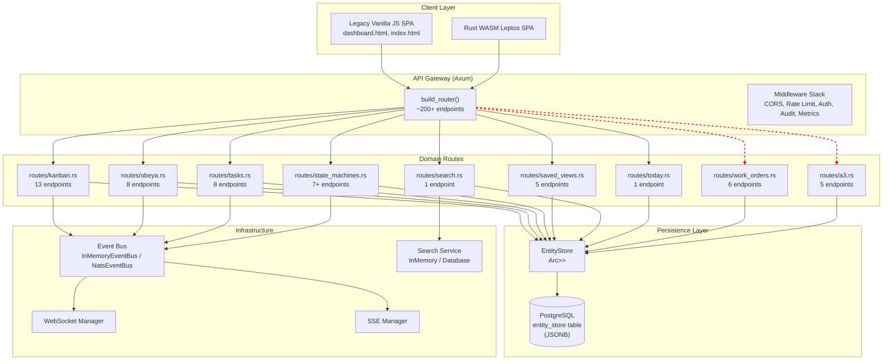
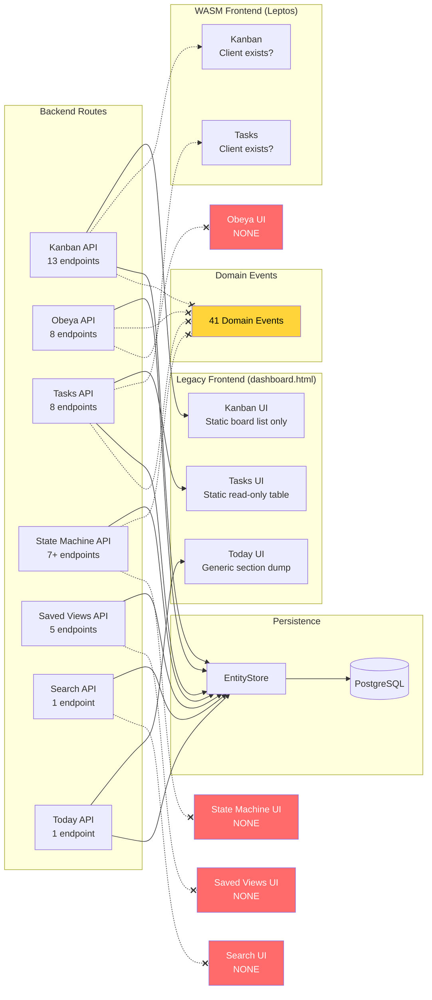

# Taiga-like PM System — Master Analysis

> **Document Type:** Cross-Cutting Master Synthesis  
> **Scope:** All 6 subsystems (Kanban, Obeya, Tasks, State Machines, Saved Views, Search) + Data Model & Stores + Frontend Integration  
> **Target Audience:** Architecture, Engineering, Product  
> **Status:** ⚠️ Pre-Production Review Required

---

## Table of Contents

1. [Executive Summary](#1-executive-summary)
2. [Architecture Overview](#2-architecture-overview)
3. [Subsystem Deep Dives](#3-subsystem-deep-dives)
   - 3.1 [Kanban System](#31-kanban-system)
   - 3.2 [Obeya System](#32-obeya-system)
   - 3.3 [Tasks System](#33-tasks-system)
   - 3.4 [State Machines](#34-state-machines)
   - 3.5 [Saved Views](#35-saved-views)
   - 3.6 [Search System](#36-search-system)
4. [Cross-Cutting Concerns](#4-cross-cutting-concerns)
5. [Integration Map](#5-integration-map)
6. [Critical Gap Matrix](#6-critical-gap-matrix)
7. [Python/SQLAlchemy Reference Model Comparison](#7-pythonsqlalchemy-reference-model-comparison)
8. [Frontend Coverage Report](#8-frontend-coverage-report)
9. [Recommendations](#9-recommendations)
10. [Architecture Roadmap](#10-architecture-roadmap)

---

## 1. Executive Summary

This document synthesizes five deep-dive analyses of the Sensei OS Taiga-like Project Management (PM) subsystem, spanning the Rust backend (`sensei-rs/crates/sensei-api`), the legacy vanilla-JS frontend (`frontend/public/`), and the WASM Leptos frontend (`frontend/`). It cross-references findings against the Python/SQLAlchemy reference model (`docs/BACKEND_DATA_MODELS_MAP.md`) to produce a unified gap analysis and prioritized remediation roadmap.

### Key Findings

| Dimension | Status | Severity |
|-----------|--------|----------|
| **EntityStore<T> persistence** | Missing DDL for `entity_store` table — DB persistence would fail at runtime | 🔴 Critical |
| **Event bus integration** | 41 domain events defined, ZERO published from PM operations | 🔴 Critical |
| **State machine enforcement** | Conditions, transitions, allowed_roles stored but NEVER enforced | 🔴 Critical |
| **Frontend coverage** | ~20-30 of 200+ API endpoints called from any frontend | 🔴 Critical |
| **Referential integrity** | 52 entity types, ZERO foreign key enforcement | 🟠 High |
| **Search indexing** | Only 4/50+ entity types indexed (Users, Accounts, Contacts, Products) | 🟠 High |
| **WIP limit enforcement** | Metrics track wip_limit_breached, but no runtime enforcement | 🟠 High |
| **Saved views sharing** | No RBAC, no visibility tiers, no sharing mechanism | 🟠 High |
| **Dual frontend fragmentation** | Legacy JS + WASM Leptos — neither fully covers the other | 🟠 High |
| **Drop-persist anti-pattern** | `StoreWriteGuard::drop()` uses `tokio::spawn` fire-and-forget | 🟠 High |

### System Maturity Assessment

```
Backend API Completeness:      █████████░░░  75% (~200 endpoints)
DB Persistence Safety:         ██████░░░░░░  55% (missing DDL, no FK)
State Machine Enforcement:     ██░░░░░░░░░░  15% (schema only)
Event Bus Integration:         ██░░░░░░░░░░  15% (events defined, not fired)
Legacy Frontend Coverage:      ██░░░░░░░░░░  15% (static read-only)
WASM Frontend Coverage:        █░░░░░░░░░░░  10% (early stage)
Search Coverage:               █░░░░░░░░░░░  10% (4 entity types)
Saved Views Adoption:          █░░░░░░░░░░░  10% (backed but unused)
```

---

## 2. Architecture Overview



**Note:** The red dashed lines from PM routes to the Event Bus indicate that while the wiring exists, NO events are actually published from these route handlers. The Event Bus is structurally connected but functionally disconnected.

### Data Flow — Current (Broken)

```
Client HTTP Request → Route Handler → EntityStore.write() → StoreWriteGuard::drop() 
                                                              ↓
                                                         tokio::spawn(persist_changes)
                                                              ↓
                                                         UPSERT entity_store (if DDL exists)
                                                         
Event Bus: [SILENT] — No PM events ever published
```

### Data Flow — Desired

```
Client HTTP Request → Route Handler → 1. EntityStore.write()
                                       2. event_bus.publish(DomainEvent)
                                       3. Search service index update
                                       4. WebSocket broadcast
                                       
StoreWriteGuard::drop() → persist_changes → UPSERT entity_store

Event Bus → Subscribers: WS broadcast, SSE, Search index, Audit log, Notifications
```

---

## 3. Subsystem Deep Dives

### 3.1 Kanban System

**Source:** [`sensei-rs/crates/sensei-api/src/routes/kanban.rs`](sensei-rs/crates/sensei-api/src/routes/kanban.rs:1)

#### Endpoints (13 total)

| Method | Path | Handler | Status |
|--------|------|---------|--------|
| GET | `/api/v1/kanban/boards` | `list_boards` | ✅ Implemented |
| POST | `/api/v1/kanban/boards` | `create_board` | ✅ Implemented |
| GET | `/api/v1/kanban/boards/:id` | `get_board` | ✅ Implemented |
| PUT | `/api/v1/kanban/boards/:id` | `update_board` | ✅ Implemented |
| DELETE | `/api/v1/kanban/boards/:id` | `delete_board` | ✅ Implemented |
| POST | `/api/v1/kanban/boards/:id/columns` | `add_column` | ✅ Implemented |
| PUT | `/api/v1/kanban/columns/:id` | `update_column` | ✅ Implemented |
| DELETE | `/api/v1/kanban/columns/:id` | `delete_column` | ✅ Implemented |
| POST | `/api/v1/kanban/boards/:id/cards` | `add_card` | ✅ Implemented |
| PUT | `/api/v1/kanban/cards/:id` | `update_card` | ✅ Implemented |
| DELETE | `/api/v1/kanban/cards/:id` | `delete_card` | ✅ Implemented |
| POST | `/api/v1/kanban/cards/:id/move` | `move_card` | ✅ Implemented |
| GET | `/api/v1/kanban/metrics` | `get_kanban_metrics` | ✅ Implemented |

#### Data Model

Key structs defined in [`sensei-rs/crates/sensei-api/src/stores.rs`](sensei-rs/crates/sensei-api/src/stores.rs:23):

```rust
pub struct KanbanBoard {
    pub id: Uuid,
    pub tenant_id: Uuid,
    pub title: String,
    pub description: Option<String>,
    pub board_type: String,        // String-enum
    pub department: Option<String>,
    pub is_active: bool,
    pub created_at: DateTime<Utc>,
    pub updated_at: DateTime<Utc>,
}

pub struct KanbanColumn {
    pub id: Uuid,
    pub board_id: Uuid,
    pub name: String,
    pub position: i32,
    pub wip_limit: Option<i32>,
    pub color: Option<String>,
    pub created_at: DateTime<Utc>,
}

pub struct KanbanCard {
    pub id: Uuid,
    pub board_id: Uuid,
    pub column_id: Uuid,
    pub title: String,
    pub description: Option<String>,
    pub priority: String,          // String-enum
    pub assignee_id: Option<Uuid>,
    pub due_date: Option<DateTime<Utc>>,
    pub tags: Vec<String>,
    pub position: i32,
    pub created_at: DateTime<Utc>,
    pub updated_at: DateTime<Utc>,
}
```

#### Gaps

| # | Gap | Location | Severity |
|---|-----|----------|----------|
| KG1 | **WIP limits not enforced** — `wip_limit` stored on column, `wip_limit_breached` reported in metrics, but `add_card`/`move_card` never check or block | `routes/kanban.rs:268-414` | 🔴 |
| KG2 | **No event bus publishing** — Card moves, creates, deletes produce no domain events | `routes/kanban.rs` | 🔴 |
| KG3 | **Cycle time calculation naive** — Matches column name containing "done" via `to_lowercase().contains("done")` | `routes/kanban.rs:441-444` | 🟠 |
| KG4 | **No swimlane support** — No concept of horizontal swimlanes on boards | Model | 🟡 |
| KG5 | **No card type/template** — All cards are generic; no task card, story card, bug card types | Model | 🟡 |
| KG6 | **No drag-and-drop reorder endpoint** — `move_card` exists but no simple reorder within same column | Routes | 🟢 |

---

### 3.2 Obeya System

**Source:** [`sensei-rs/crates/sensei-api/src/routes/obeya.rs`](sensei-rs/crates/sensei-api/src/routes/obeya.rs:1)

#### Endpoints (8 total)

| Method | Path | Handler | Status |
|--------|------|---------|--------|
| GET | `/api/v1/obeya/boards` | `list_boards` | ✅ Implemented (filters: board_type, department, is_active) |
| POST | `/api/v1/obeya/boards` | `create_board` | ✅ Implemented |
| GET | `/api/v1/obeya/boards/:id` | `get_board` | ✅ Implemented |
| PUT | `/api/v1/obeya/boards/:id` | `update_board` | ✅ Implemented (soft-delete via is_active=false) |
| DELETE | `/api/v1/obeya/boards/:id` | `delete_board` | ✅ Implemented |
| GET | `/api/v1/obeya/boards/:id/items` | `list_board_items` | ✅ Implemented (filters: status, item_type, priority) |
| POST | `/api/v1/obeya/boards/:id/items` | `add_board_item` | ✅ Implemented |
| PUT | `/api/v1/obeya/items/:id` | `update_board_item` | ✅ Implemented |

#### Data Model

```rust
pub struct ObeyaBoard {
    pub id: Uuid,
    pub tenant_id: Uuid,
    pub title: String,
    pub description: Option<String>,
    pub board_type: String,         // e.g., "strategy", "operations", "quality"
    pub department: Option<String>,
    pub is_active: bool,
    pub config: Option<serde_json::Value>,  // untyped JSONB
    pub created_at: DateTime<Utc>,
    pub updated_at: DateTime<Utc>,
}

pub struct ObeyaItem {
    pub id: Uuid,
    pub board_id: Uuid,
    pub title: String,
    pub description: Option<String>,
    pub item_type: String,          // e.g., "kpi", "objective", "risk", "action"
    pub status: String,             // defaults to "Open"
    pub priority: String,           // defaults to "Medium"
    pub assignee_id: Option<Uuid>,
    pub due_date: Option<DateTime<Utc>>,
    pub metadata: Option<serde_json::Value>,
    pub completed_at: Option<DateTime<Utc>>,
    pub position: i32,
    pub created_at: DateTime<Utc>,
    pub updated_at: DateTime<Utc>,
}
```

#### Gaps

| # | Gap | Location | Severity |
|---|-----|----------|---------|
| OG1 | **No event bus publishing** — Item status changes, creation produce no domain events | `routes/obeya.rs` | 🔴 |
| OG2 | **No Obeya board comments** — No comment/thread model for Obeya items | Model | 🟠 |
| OG3 | **No Obeya board metrics** — No aggregated metrics endpoint like Kanban | Routes | 🟠 |
| OG4 | **String-enum for status/priority** — No validation, free-text drift possible | `stores.rs:354-369` | 🟡 |
| OG5 | **No item type templates** — No schema per item_type to enforce required fields | Model | 🟡 |
| OG6 | **No recurring/standing item support** — Items that auto-renew each period | Model | 🟢 |

---

### 3.3 Tasks System

**Source:** [`sensei-rs/crates/sensei-api/src/routes/tasks.rs`](sensei-rs/crates/sensei-api/src/routes/tasks.rs:1)

#### Endpoints (8 total)

| Method | Path | Handler | Status |
|--------|------|---------|--------|
| GET | `/api/v1/tasks` | `list_tasks` | ✅ Implemented (filters: status, assignee_id, priority, category) |
| POST | `/api/v1/tasks` | `create_task` | ✅ Implemented (default status "open") |
| GET | `/api/v1/tasks/:id` | `get_task` | ✅ Implemented |
| PUT | `/api/v1/tasks/:id` | `update_task` | ✅ Implemented |
| DELETE | `/api/v1/tasks/:id` | `delete_task` | ✅ Implemented |
| PUT | `/api/v1/tasks/:id/status` | `update_task_status` | ✅ Implemented (free-form String) |
| PUT | `/api/v1/tasks/:id/assign` | `assign_task` | ✅ Implemented |
| GET | `/api/v1/tasks/stats` | `get_task_stats` | ✅ Implemented |

#### Critical Issue — No State Machine Integration

Tasks have their own `update_task_status` endpoint that accepts **free-form String** status values. Meanwhile, the State Machine subsystem (section 3.4) provides a complete framework for defining states, transitions, conditions, and role-based guards — but **tasks never use it**.

```rust
// tasks.rs:262-278 — Pure string-based status update
pub async fn update_task_status(
    Path(id): Path<Uuid>,
    Json(req): Json<UpdateStatusRequest>,  // { status: String }
) -> Result<Json<Value>, AppError> {
    // ... directly writes status string, no SM validation
}
```

#### Gaps

| # | Gap | Location | Severity |
|---|-----|----------|---------|
| TG1 | **No state machine enforcement** — Status is free-form String, bypasses SM subsystem entirely | `routes/tasks.rs:262-278` | 🔴 |
| TG2 | **No event bus publishing** — Task create/update/status_change/assign produce no events | `routes/tasks.rs` | 🔴 |
| TG3 | **No task dependencies/blocks** — No concept of task blocking or depends_on | Model | 🟠 |
| TG4 | **No subtasks/checklist** — No hierarchical task decomposition | Model | 🟠 |
| TG5 | **No task comments/activity feed** — No per-task discussion or audit trail | Model | 🟠 |
| TG6 | **No due date enforcement** — `overdue` in stats but no notifications/alerts on due dates | `routes/tasks.rs:300-352` | 🟠 |
| TG7 | **String-enum degradation** — `priority` field is String, not a typed enum | `stores.rs:542-558` | 🟡 |

---

### 3.4 State Machines

**Source:** [`sensei-rs/crates/sensei-api/src/routes/state_machines.rs`](sensei-rs/crates/sensei-api/src/routes/state_machines.rs:1)

#### Endpoints (7+ total)

| Method | Path | Handler | Status |
|--------|------|---------|--------|
| GET | `/api/v1/state-machines` | `list_state_machines` | ✅ Implemented |
| POST | `/api/v1/state-machines` | `create_state_machine` | ✅ Implemented |
| GET | `/api/v1/state-machines/:id` | `get_state_machine` | ✅ Implemented |
| PUT | `/api/v1/state-machines/:id` | `update_state_machine` | ✅ Implemented |
| DELETE | `/api/v1/state-machines/:id` | `delete_state_machine` | ✅ Implemented |
| POST | `/api/v1/state-machines/:id/instances` | `create_instance` | ✅ Implemented |
| GET | `/api/v1/state-machines/instances` | `list_instances` | ✅ Implemented |
| GET | `/api/v1/state-machines/instances/:id` | `get_instance` | ✅ Implemented |
| POST | `/api/v1/state-machines/instances/:id/transition` | `transition_instance` | ✅ Implemented |

#### Data Model — Rich Schema, Zero Enforcement

```rust
pub struct StateMachineDefinition {
    pub id: Uuid,
    pub tenant_id: Uuid,
    pub name: String,
    pub entity_type: String,        // Which entity type this SM governs
    pub states: Vec<StateDefinition>,
    pub transitions: Vec<TransitionDefinition>,
    pub initial_state: String,
    pub is_active: bool,
    pub created_at: DateTime<Utc>,
    pub updated_at: DateTime<Utc>,
}

pub struct StateDefinition {
    pub name: String,
    pub label: String,
    pub is_terminal: bool,
    pub on_entry_actions: Option<serde_json::Value>,   // STORED, NOT ENFORCED
    pub on_exit_actions: Option<serde_json::Value>,     // STORED, NOT ENFORCED
}

pub struct TransitionDefinition {
    pub from_state: String,
    pub to_state: String,
    pub event: String,
    pub conditions: Option<serde_json::Value>,          // STORED, NOT ENFORCED
    pub on_transition: Option<serde_json::Value>,       // STORED, NOT ENFORCED
    pub allowed_roles: Option<Vec<String>>,             // STORED, NOT ENFORCED
}
```

The `transition_instance` handler performs a simple lookup: find a matching `(from_state, event)` transition. If found, it updates the instance's current state. If not found, it returns `transition_applied: false` gracefully.

**What it does NOT do:**
- ❌ Evaluate `conditions` (e.g., "only if assignee_id is set")
- ❌ Execute `on_transition` hooks (e.g., "send notification to assignee")
- ❌ Check `allowed_roles` against the current user's role
- ❌ Execute `on_entry_actions` / `on_exit_actions`
- ❌ Publish events to the event bus
- ❌ Integrate with any entity route (tasks, kanban cards, work orders)

#### Gaps

| # | Gap | Location | Severity |
|---|-----|----------|---------|
| SMG1 | **No runtime enforcement** — Conditions, roles, hooks stored but never executed | `routes/state_machines.rs:310-373` | 🔴 |
| SMG2 | **No entity integration** — No route handler calls SM to validate transitions | System-wide | 🔴 |
| SMG3 | **No event bus publishing on transitions** | `routes/state_machines.rs` | 🔴 |
| SMG4 | **No transition history persistence** — StateTransitionRecord exists but transitions may not be logged | `stores.rs:1007-1014` | 🟠 |
| SMG5 | **No parallel states** — No support for orthogonal state regions | Model | 🟡 |

---

### 3.5 Saved Views

**Source:** [`sensei-rs/crates/sensei-api/src/routes/saved_views.rs`](sensei-rs/crates/sensei-api/src/routes/saved_views.rs:1)

#### Endpoints (5 total)

| Method | Path | Handler | Status |
|--------|------|---------|--------|
| GET | `/api/v1/saved-views` | `list_saved_views` | ✅ Implemented |
| POST | `/api/v1/saved-views` | `create_saved_view` | ✅ Implemented |
| GET | `/api/v1/saved-views/:id` | `get_saved_view` | ✅ Implemented |
| PUT | `/api/v1/saved-views/:id` | `update_saved_view` | ✅ Implemented |
| DELETE | `/api/v1/saved-views/:id` | `delete_saved_view` | ✅ Implemented |

#### Data Model

```rust
pub struct SavedView {
    pub id: Uuid,
    pub tenant_id: Uuid,
    pub user_id: Uuid,
    pub name: String,
    pub entity_type: String,                // e.g., "tasks", "kanban_boards"
    pub filters: serde_json::Value,         // untyped JSONB — no schema validation
    pub sort_by: Option<String>,
    pub sort_order: Option<String>,
    pub columns: Vec<String>,               // column visibility config
    pub is_default: bool,
    pub created_at: DateTime<Utc>,
    pub updated_at: DateTime<Utc>,
}
```

#### Gaps

| # | Gap | Location | Severity |
|---|-----|----------|---------|
| SVG1 | **No sharing/RBAC** — User-scoped only; no team/role/visibility tiers | Model | 🟠 |
| SVG2 | **Untyped filters** — `filters: serde_json::Value` has no schema per entity_type | `stores.rs:612-625` | 🟠 |
| SVG3 | **No frontend adoption** — Backend endpoints exist but no frontend UI | System-wide | 🔴 |
| SVG4 | **No analytics** — No view usage tracking, no "most used views" | Model | 🟢 |
| SVG5 | **No compound sorting** — Only single-field sort_by + sort_order | Model | 🟢 |

---

### 3.6 Search System

**Source:** [`sensei-rs/crates/sensei-api/src/routes/search.rs`](sensei-rs/crates/sensei-api/src/routes/search.rs:1)

#### Endpoints (1 total)

| Method | Path | Handler | Status |
|--------|------|---------|--------|
| GET | `/api/v1/search` | `search_handler` | ✅ Implemented |

#### Indexed Entity Types

Only **4 of 50+** entity types are indexed:

| Entity | Indexed? | Notes |
|--------|----------|-------|
| Users | ✅ | Name, email search |
| Accounts | ✅ | Name, contact info |
| Contacts | ✅ | Name, email, phone |
| Products | ✅ | Name, SKU, description |
| Kanban Boards/Cards | ❌ | **NOT indexed** |
| Tasks | ❌ | **NOT indexed** |
| Work Orders | ❌ | **NOT indexed** |
| Obeya Boards/Items | ❌ | **NOT indexed** |
| All other entities | ❌ | **NOT indexed** |

#### Search Backends

1. **InMemorySearchService** — Tiered scoring algorithm (exact match → prefix → substring → word-overlap), in-memory HashMap storage
2. **DatabaseSearchService** — `pg_trgm` trigram similarity via `search_all()` PostgreSQL function

#### Gaps

| # | Gap | Location | Severity |
|---|-----|----------|---------|
| SRG1 | **Only 4 entity types indexed** — PM entities (tasks, kanban, work orders) invisible to search | System-wide | 🔴 |
| SRG2 | **No frontend search UI** — No search bar in either frontend | System-wide | 🔴 |
| SRG3 | **No full-text search** — Uses trigram only, no `tsvector`/`tsquery` full-text | Backend | 🟠 |
| SRG4 | **No faceted filtering** — Results have no category/count facets | Model | 🟠 |
| SRG5 | **No relevance tuning** — No per-entity-type boost factors | Model | 🟡 |
| SRG6 | **No search analytics** — No tracking of popular searches, no-Result queries | Model | 🟢 |

---

## 4. Cross-Cutting Concerns

### 4.1 Event Bus Disconnection

**Severity:** 🔴 Critical

The system defines **41 domain events** across 9 domains in [`events.rs`](sensei-rs/crates/sensei-core/src/events.rs):

| Domain | Events | Published from PM? |
|--------|--------|-------------------|
| Identity | UserCreated, UserLoggedIn, etc. | N/A |
| Quality | NcrCreated, CapaCreated, etc. | Separate system |
| Production | WorkOrderCreated, WorkOrderCompleted, etc. | Separate system |
| **PM (Kanban)** | — | **No events defined** |
| **PM (Tasks)** | — | **No events defined** |
| **PM (Obeya)** | — | **No events defined** |
| **PM (State Machines)** | — | **No events defined** |

**Impact:**
- WebSocket/SSE broadcasts cannot notify clients of PM changes
- No audit trail for PM operations
- No integration hooks for external systems
- No notification triggers for task assignments, card moves, etc.

### 4.2 Missing DDL for `entity_store` Table

**Severity:** 🔴 Critical

**Source:** [`postgres-init/01-init.sql`](postgres-init/01-init.sql)

The `01-init.sql` migration file comprehensively defines schemas for users, tenants, roles, accounts, contacts, products, work orders, quality, kanban boards (with columns, cards, metrics), obeya (boards, items), tasks, state machines (definitions, instances, transitions), and many more (200+ tables total).

However, the [`EntityStore<T>`](sensei-rs/crates/sensei-api/src/db_stores.rs:36) persistence layer does **NOT** use any of those tables. It uses a single generic table:

```sql
-- MISSING FROM 01-init.sql:
CREATE TABLE entity_store (
    id UUID NOT NULL,
    tenant_id UUID NOT NULL,
    entity_type VARCHAR(128) NOT NULL,
    data JSONB NOT NULL,
    created_at TIMESTAMPTZ NOT NULL DEFAULT NOW(),
    updated_at TIMESTAMPTZ NOT NULL DEFAULT NOW(),
    PRIMARY KEY (tenant_id, id, entity_type)
);
```

Without this DDL, production deployments will fail with `relation "entity_store" does not exist` errors on first write attempt. All 52 entity types currently persisted through `EntityStore<T>` will silently lose data on PostgreSQL-backed deployments.

### 4.3 Drop-Persist Anti-Pattern

**Source:** [`sensei-rs/crates/sensei-api/src/db_stores.rs:216-239`](sensei-rs/crates/sensei-api/src/db_stores.rs:216)

```rust
impl<T: ...> Drop for StoreWriteGuard<'_, T> {
    fn drop(&mut self) {
        let pool = match self.inner.pool.clone() { None => return; ... };
        let entity_type = self.inner.entity_type.clone();
        let changed_keys = self.changed_keys.clone();
        let removed_keys = self.removed_keys.clone();
        let data_snapshot = self.inner.data.clone();
        
        tokio::spawn(async move {
            // Fire-and-forget persistence
            let _ = persist_changes(pool, &entity_type, &changed_keys, &removed_keys, &data_snapshot).await;
        });
    }
}
```

**Issues:**
- ❌ Fire-and-forget: no `.await` on the spawned task
- ❌ No error handling: `let _ = ...` silently swallows all DB errors
- ❌ No backpressure: concurrent writes can flood tokio's task queue
- ❌ No ordering guarantee: async tasks may persist out of order
- ❌ `data_snapshot` clones entire HashMap on every drop

### 4.4 String-Enum Degradation

Throughout [`stores.rs`](sensei-rs/crates/sensei-api/src/stores.rs), several fields use `String` where a typed enum exists or should exist:

| Struct | Field | Current Type | Should Be |
|--------|-------|-------------|-----------|
| `KanbanBoard` | `board_type` | `String` | `KanbanBoardType` enum |
| `KanbanCard` | `priority` | `String` | `Priority` enum |
| `ObeyaItem` | `status` | `String` (default "Open") | `ObeyaItemStatus` enum |
| `ObeyaItem` | `priority` | `String` (default "Medium") | `Priority` enum |
| `Task` | `priority` | `String` | `Priority` enum |
| `Task` | `status` | `String` (free-form) | Should use State Machine |

This leads to data drift, invalid states, and makes querying/filtering unreliable.

### 4.5 Zero Referential Integrity

**Source:** [`sensei-rs/crates/sensei-api/src/stores.rs`](sensei-rs/crates/sensei-api/src/stores.rs)

All UUID foreign key fields (e.g., `board_id`, `column_id`, `assignee_id`, `tenant_id`) are plain `Uuid` with **no FK enforcement**:

```rust
pub struct KanbanCard {
    pub board_id: Uuid,      // No FK to KanbanBoard
    pub column_id: Uuid,     // No FK to KanbanColumn
    pub assignee_id: Option<Uuid>,  // No FK to Users
    // ...
}
```

In the current `EntityStore<T>` architecture, each entity type lives in its own HashMap, so cross-entity referential integrity is purely convention-based. Orphaned references are silently tolerated.

### 4.6 Pagination & Filtering

**Source:** [`sensei-rs/crates/sensei-api/src/db_stores.rs`](sensei-rs/crates/sensei-api/src/db_stores.rs)

The `EntityStore<T>` layer provides no built-in pagination or filtering. Each route handler implements its own in-memory filtering by iterating over the HashMap:

```rust
// Common pattern across all route handlers:
let store = state.kanban_boards.read().await;
let boards: Vec<_> = store
    .values()
    .filter(|b| params.board_type.as_ref().map_or(true, |t| b.board_type == *t))
    // ... more filters
    .collect();
```

This works for small datasets but will degrade catastrophically as data grows. No `LIMIT`, `OFFSET`, cursor-based pagination, or server-side sorting.

### 4.7 Dual Frontend Fragmentation

**Source:** [`docs/analysis/frontend-integration-deep-dive.md`](docs/analysis/frontend-integration-deep-dive.md:1)

Two parallel frontend implementations exist:

| Frontend | Tech | Routes/Pages | State | Coverage |
|----------|------|-------------|-------|----------|
| Legacy | Vanilla JS, innerHTML | 11 sections in dashboard.html | Global `state` object | ~15% of API |
| Modern | Rust WASM (Leptos) | 8 route groups | Leptos signals | ~10% of API |

**Neither is a superset of the other.** The legacy frontend has Users and Supply Chain sections the WASM frontend lacks. The WASM frontend has Operations the legacy lacks. Both lack Kanban board views, task CRUD, Obeya, State Machines, Search, and Saved Views.

---

## 5. Integration Map



**Legend:**
- Solid line = Connected and working
- Dashed line = Partial/uncertain connection
- Dashed with `x` = Should connect but does NOT
- Red fill = Missing entirely

---

## 6. Critical Gap Matrix

### Top 20 Issues by Severity

| ID | Gap | Subsystem | Impact | Severity | Effort |
|----|-----|-----------|--------|----------|--------|
| **G1** | Missing `entity_store` table DDL | Persistence | DB persistence fails on PostgreSQL-backed deployment | 🔴 Critical | Low (1 line DDL) |
| **G2** | No event bus publishing from PM routes | All PM subsystems | No real-time updates, no audit trail, no integration hooks | 🔴 Critical | Medium |
| **G3** | No state machine enforcement | State Machines + Tasks | Rich SM schema completely unused; tasks use free-form strings | 🔴 Critical | High |
| **G4** | No frontend for Obeya | Obeya | 8 backend endpoints with zero UI | 🔴 Critical | High |
| **G5** | No frontend for State Machines | State Machines | 7+ backend endpoints with zero UI | 🔴 Critical | High |
| **G6** | No frontend for Search | Search | Search API exists but no search bar in any frontend | 🔴 Critical | Medium |
| **G7** | No frontend for Saved Views | Saved Views | 5 backend endpoints with zero UI | 🔴 Critical | Medium |
| **G8** | Search indexes only 4 entity types | Search | Tasks, Kanban, Work Orders invisible to search | 🔴 Critical | Medium |
| **G9** | WIP limits not enforced | Kanban | wip_limit stored, wip_limit_breached reported, but never blocks | 🟠 High | Medium |
| **G10** | Drop-persist anti-pattern | Persistence | Fire-and-forget DB writes, silent error swallowing | 🟠 High | High |
| **G11** | Zero referential integrity | All subsystems | Orphaned references silently tolerated across 52 entity types | 🟠 High | Very High |
| **G12** | No pagination in EntityStore | Persistence | In-memory filtering degrades catastrophically with data growth | 🟠 High | High |
| **G13** | Cycle time calculation naive | Kanban | Column name string matching is fragile and wrong | 🟠 High | Low |
| **G14** | No Kanban board UI | Kanban | Legacy shows only board list; no columns, cards, or drag-and-drop | 🟠 High | Very High |
| **G15** | No task CRUD UI | Tasks | Legacy shows static read-only table; no create/edit/status update | 🟠 High | Very High |
| **G16** | String-enum degradation | All PM subsystems | Free-text String fields allow invalid states and data drift | 🟠 High | Medium |
| **G17** | Dual frontend fragmentation | Frontend | Neither legacy nor WASM covers the other; massive duplication | 🟠 High | Very High |
| **G18** | No saved views sharing/RBAC | Saved Views | User-scoped only; no team/role/visibility tiers | 🟠 Medium | Medium |
| **G19** | No task dependencies/subtasks | Tasks | No blocking, hierarchy, or checklist support | 🟠 Medium | High |
| **G20** | No full-text search | Search | Trigram only, no tsvector/tsquery | 🟡 Medium | Medium |

### Gap Severity Distribution

```
🔴 Critical:  8 gaps  (40%)
🟠 High:      9 gaps  (45%)
🟡 Medium:    3 gaps  (15%)
🟢 Low:       0 gaps  (0%)
```

---

## 7. Python/SQLAlchemy Reference Model Comparison

**Source:** [`docs/BACKEND_DATA_MODELS_MAP.md`](docs/BACKEND_DATA_MODELS_MAP.md:1)

The Python/SQLAlchemy model represents a production-proven implementation with 200+ normalized tables, proper foreign keys, and mature features. Key differences:

### 7.1 Schema Maturity

| Aspect | Rust (Current) | Python (Reference) |
|--------|---------------|-------------------|
| Tables | 1 generic (`entity_store` via JSONB) + 200+ unused SQL tables | 200+ normalized SQL tables |
| Foreign Keys | Zero — all UUIDs are plain | Proper FK constraints throughout |
| Migrations | Manual DDL in `01-init.sql` | Alembic migration framework |
| Schema Enforcement | `serde_json::Value` (untyped) at JSONB level | Strict SQL column types |
| Indexes | None on JSONB data | Proper B-tree, GiST, GIN indexes |

### 7.2 Feature Comparison

| Feature | Rust | Python | Gap |
|---------|------|--------|-----|
| **Kanban:** WIP enforcement | ❌ Not enforced | ✅ Enforced | Critical |
| **Kanban:** Board templates | ❌ | ✅ `board_views` table | Medium |
| **Kanban:** Swimlanes | ❌ | ✅ Horizontal swimlanes | Medium |
| **Obeya:** Comments | ❌ | ✅ `obeya_comments` | High |
| **Obeya:** Metrics | ❌ | ✅ KPI integration | High |
| **Tasks:** Dependencies | ❌ | ✅ Task links/blocks | High |
| **Tasks:** Subtasks | ❌ | ✅ Hierarchical | High |
| **Tasks:** Attachments | ❌ Generic `attachments` | ✅ Per-task attachments | Medium |
| **State Machines:** Enforcement | ❌ Stored only | ✅ Runtime enforcement | Critical |
| **State Machines:** Hooks | ❌ Stored only | ✅ Event-driven actions | Critical |
| **Saved Views:** Visibility tiers | ❌ User-scoped only | ✅ `visibility` enum (private/team/role/public) | High |
| **Saved Views:** Sharing | ❌ | ✅ `segment_shares` table | High |
| **Saved Views:** Analytics | ❌ | ✅ `segment_usage` tracking | Low |
| **Search:** Entity coverage | 4 types | All major entities | Critical |
| **Search:** Full-text | ❌ Trigram only | ✅ `tsvector` + `tsquery` | Medium |
| **Search:** Faceted | ❌ | ✅ Category/count facets | Medium |
| **Search:** Semantic | ❌ | ✅ `pgvector` embeddings (384d) | Low |
| **Autosave drafts** | ❌ | ✅ `autosave_drafts` + `autosave_draft_versions` | Medium |
| **Notifications:** Trigger engine | ❌ | ✅ `notification_triggers` + templates | High |
| **Audit trail** | Generic JSONB | ✅ `audit_logs` partitioned by range | Medium |

### 7.3 Python Advantages Summary

The Python model has **mature features** the Rust implementation lacks:
1. **Proper relational integrity** — 200+ tables with FK constraints, cascading deletes
2. **Segments system** — Rich visibility tiers, sharing, usage analytics
3. **Autosave** — Draft versioning with periodic auto-save
4. **Full-text search** — tsvector/tsquery + pgvector for semantic search
5. **Notification triggers** — Template-based, condition-evaluated notification engine
6. **Kanban board views** — Multiple saved views per board with position/template config
7. **Task hierarchy** — Subtasks, dependencies, blocking relationships
8. **Obeya comments** — Threaded discussions on Obeya items

---

## 8. Frontend Coverage Report

### 8.1 API Endpoints With ZERO Frontend UI

These backend APIs exist but have **no UI in either frontend**:

| # | API Module | Endpoints | Legacy JS | WASM |
|---|-----------|-----------|-----------|------|
| 1 | **Obeya** | 8 endpoints | ❌ | ❌ |
| 2 | **State Machines** | 7+ endpoints | ❌ | ❌ |
| 3 | **Search** | 1 endpoint | ❌ | ❌ |
| 4 | **Saved Views** | 5 endpoints | ❌ | ❌ |
| 5 | **A3 Reports** | 5 endpoints | ❌ | ❌ |
| 6 | **Risk Management** | ? | ❌ | ❌ |
| 7 | **CTQ** | ? | ❌ | ❌ |
| 8 | **KPI** | ? | ❌ | ❌ |
| 9 | **LSW** | ? | ❌ | ❌ |
| 10 | **Standard Work** | ? | ❌ | ❌ |
| 11 | **Notification Triggers** | ? | ❌ | ❌ |
| 12 | **Training** | ? | ❌ | ❌ |
| 13 | **Training Matrix** | ? | ❌ | ❌ |
| 14 | **Knowledge Pack** | ? | ❌ | ❌ |
| 15 | **Smart Ingestion** | ? | ❌ | ❌ |
| 16 | **MRP** | ? | ❌ | ❌ |
| 17 | **Inventory** | ? | ❌ | ❌ |
| 18 | **Quoting Helper** | ? | ❌ | ❌ |
| 19 | **Escalation Policy** | ? | ❌ | ❌ |
| 20 | **Admin** | ? | ❌ | ❌ |

**Total: ~20+ API areas with zero frontend coverage.**

### 8.2 Features With Limited Frontend Coverage

| Feature | Coverage | Quality | Issues |
|---------|----------|---------|--------|
| **Dashboard** | ✅ Legacy only | ⚠️ Basic | Static metric cards, no interactivity |
| **Today** | ✅ Legacy only | ⚠️ Basic | Generic section dump via `renderObjectSection()` |
| **Tasks** | ⚠️ Legacy read-only | ❌ Poor | Static table, 5 columns, no CRUD/filter/sort ([`dashboard.html:L1181-L1204`](frontend/public/dashboard.html:1181)) |
| **Kanban** | ⚠️ Legacy board list | ❌ Poor | Board list as static cards grid ([`dashboard.html:L1148-L1179`](frontend/public/dashboard.html:1148)), no columns/cards/DnD |
| **Production** | ⚠️ Legacy only | ⚠️ Basic | Work Orders table |
| **Quality** | ⚠️ Legacy only | ⚠️ Basic | NCRs table |
| **Maintenance** | ⚠️ Legacy only | ⚠️ Basic | Work Requests table |
| **HR** | ⚠️ Legacy only | ⚠️ Basic | Employee list |
| **Finance** | ⚠️ Legacy only | ⚠️ Basic | Generic table |
| **Supply Chain** | ⚠️ Legacy only | ⚠️ Basic | Generic table |
| **Users** | ⚠️ Legacy only | ⚠️ Basic | User list |

### 8.3 Legacy Frontend Quality Assessment

| Dimension | Assessment |
|-----------|-----------|
| **Rendering** | Mixed innerHTML + DOM manipulation — XSS vulnerable with untrusted data |
| **State** | Global mutable `state` object — no immutability, no change detection |
| **API calls** | Sequential `fetch()` chain — waterfall loading, no parallelization |
| **Caching** | None — re-fetches on every navigation |
| **Error handling** | Basic try/catch with alert() — no user-friendly error messages |
| **Accessibility** | ARIA labels present but no keyboard navigation, no focus management |
| **CSS** | 781 lines inline in dashboard.html — no preprocessor, no variables (in that section) |
| **Security** | localStorage tokens, no CSP headers, innerHTML rendering |

### 8.4 WASM Frontend Status

The WASM Leptos frontend is in **early development** with 8 route groups. It's unclear from available files which API endpoints it actually calls. The `build-frontend-wasm.sh` script suggests it's buildable but the coverage is estimated at ~10-15% of backend API.

---

## 9. Recommendations

### Priority 0 — Critical (Must Fix Before Production)

| ID | Recommendation | Effort | Risk if Deferred |
|----|--------------|--------|-----------------|
| **R0.1** | Add `entity_store` table DDL to `01-init.sql` | 1 line | Production DB fails on first write |
| **R0.2** | Add error handling to StoreWriteGuard::drop() — log failures, consider retry queue | 2-3 days | Silent data loss on DB errors |
| **R0.3** | Publish domain events from all PM route handlers (create, update, delete, status change, move) | 1 week | No real-time updates, no audit, no integration |
| **R0.4** | Integrate state machine enforcement into task status updates and kanban card movements | 2-3 weeks | State machines remain decorative; no transition validation |

### Priority 1 — High (Required for Taiga-like Functionality)

| ID | Recommendation | Effort |
|----|--------------|--------|
| **R1.1** | Implement WIP limit enforcement in `add_card` and `move_card` handlers | 3-5 days |
| **R1.2** | Build Kanban board view UI (columns, cards, drag-and-drop) in one frontend | 4-6 weeks |
| **R1.3** | Build Task CRUD UI (create, edit, status update, filtering, sorting) | 3-4 weeks |
| **R1.4** | Build Search UI (search bar, results display) | 2-3 weeks |
| **R1.5** | Index Tasks, Kanban Cards, Work Orders in search service | 1 week |
| **R1.6** | Build Saved Views management UI (create, list, apply, delete) | 2-3 weeks |
| **R1.7** | Build Obeya board UI (board view, item management) | 3-4 weeks |
| **R1.8** | Replace String enums with typed Rust enums for status/priority across all PM models | 1 week |
| **R1.9** | Implement cursor-based pagination in EntityStore | 2 weeks |

### Priority 2 — Medium (Important for Parity)

| ID | Recommendation | Effort |
|----|--------------|--------|
| **R2.1** | Implement state machine conditions evaluation and role-based access | 2 weeks |
| **R2.2** | Implement state machine on_entry/on_exit action hooks | 1 week |
| **R2.3** | Add saved views visibility tiers (private, team, role, public) | 1 week |
| **R2.4** | Add full-text search (tsvector/tsquery) alongside trigram | 1-2 weeks |
| **R2.5** | Add task dependencies (blocking, depends_on) | 2 weeks |
| **R2.6** | Add subtasks / checklist support to tasks | 2 weeks |
| **R2.7** | Add Obeya board comments | 1 week |
| **R2.8** | Add Obeya board metrics endpoint | 3-5 days |
| **R2.9** | Fix cycle time calculation to use actual timestamps, not column names | 1 day |
| **R2.10** | Improve StoreWriteGuard::drop() — batch writes, add backpressure, ordered persistence | 1-2 weeks |
| **R2.11** | Add autosave drafts for tasks and kanban cards | 1-2 weeks |
| **R2.12** | Add compound sorting support to saved views | 3-5 days |
| **R2.13** | Add frontend error handling (user-friendly messages, retry logic, offline detection) | 2 weeks |
| **R2.14** | Replace innerHTML rendering with DOM API or template engine (XSS mitigation) | 2 weeks |

### Priority 3 — Enhancement (Nice to Have)

| ID | Recommendation | Effort |
|----|--------------|--------|
| **R3.1** | Add Kanban swimlane support | 2 weeks |
| **R3.2** | Add Kanban card types/templates | 1-2 weeks |
| **R3.3** | Add faceted search results | 1 week |
| **R3.4** | Add search analytics (popular searches, no-result queries) | 1 week |
| **R3.5** | Add saved views usage analytics | 3-5 days |
| **R3.6** | Add task due date notifications | 1 week |
| **R3.7** | Add Obeya recurring items (auto-renew) | 1 week |
| **R3.8** | Implement parallel state machine states | 2-3 weeks |
| **R3.9** | Add semantic search via pgvector embeddings | 2-3 weeks |
| **R3.10** | Evaluate and choose primary frontend strategy (legacy vs WASM) | 2 weeks |

### Implementation Effort Summary

```
P0 (Critical):    ~4-5 weeks total   🔴 Must fix before any production deployment
P1 (High):        ~20-25 weeks       🟠 Required for minimum viable Taiga-like system
P2 (Medium):      ~17-22 weeks       🟡 Important for feature parity
P3 (Enhancement): ~13-16 weeks       🟢 Nice-to-have improvements
```

---

## 10. Architecture Roadmap

### Phase 1 — Stabilize Foundation (Weeks 1-3)

**Objective:** Make the existing system production-safe without new features.

```
Week 1:  Fix G1 — Add entity_store DDL
         Fix G10 — Add error handling to StoreWriteGuard::drop()
         Fix G16 — Replace String enums with typed enums (priority, status, board_type)

Week 2:  Fix G2 — Publish domain events from Kanban routes
         Fix G2 — Publish domain events from Tasks routes
         Fix G2 — Publish domain events from Obeya routes

Week 3:  Fix G12 — Add cursor-based pagination to EntityStore
         Fix G10 — Improve batch persistence, add backpressure
         Security audit of legacy frontend (innerHTML, localStorage, CSP)
```

**Deliverable:** Production-safe backend with proper error handling, typed enums, event publishing, and pagination.

### Phase 2 — Core PM Frontend (Weeks 4-10)

**Objective:** Build minimum viable frontend coverage for the 4 critical PM subsystems.

```
Week 4-5:   Fix R1.2 — Kanban board view (columns, cards, drag-and-drop, WIP enforcement)
            Choose primary frontend strategy (recommend: commit to WASM Leptos)

Week 6-7:   Fix R1.3 — Task CRUD UI (list, create, edit, status update, filter, sort)
            Fix R0.4 — Integrate task status with state machine enforcement

Week 8:     Fix R1.4 — Search UI (search bar, results display)
            Fix R1.5 — Index Tasks, Kanban Cards, Work Orders in search

Week 9-10:  Fix R1.6 — Saved Views management UI
            Fix R1.7 — Obeya board UI
```

**Deliverable:** Functional PM frontend covering Kanban, Tasks, Search, Saved Views, and Obeya.

### Phase 3 — State Machine & Enforcement (Weeks 11-14)

**Objective:** Make state machines actually enforce transitions, conditions, and roles.

```
Week 11:   Fix R2.1 — Conditions evaluation engine
           Fix SMG1 — Runtime role checking on transitions

Week 12:   Fix R2.2 — On_entry/on_exit action hooks
           Fix SMG2 — Integrate SM into task and kanban routes

Week 13:   Fix R1.9 — WIP limit enforcement (already in P1, reinforce here)
           Fix R2.9 — Cycle time calculation fix

Week 14:   Add state machine management UI (define, visualize, test)
           Add task dependency / blocking model (R2.5)
```

**Deliverable:** State machines that actually govern entity behavior, with management UI.

### Phase 4 — Feature Parity (Weeks 15-22)

**Objective:** Close feature gaps with the Python/SQLAlchemy reference model.

```
Week 15-16: Fix R2.4 — Full-text search (tsvector/tsquery)
            Fix R2.3 — Saved views visibility tiers and sharing

Week 17-18: Fix R2.6 — Subtasks / checklist
            Fix R2.7 — Obeya board comments
            Fix R2.8 — Obeya metrics endpoint

Week 19-20: Fix R2.11 — Autosave drafts
            Fix R2.13 — Frontend error handling overhaul
            Fix R2.14 — innerHTML replacement (XSS mitigation)

Week 21-22: Fix R2.10 — StoreWriteGuard rewrite (ordered persistence, batch, backpressure)
            Fix R2.12 — Compound sorting for saved views
```

**Deliverable:** Near-feature-parity with Python reference model for core PM features.

### Phase 5 — Polish & Scale (Weeks 23-28)

**Objective:** Performance optimization, analytics, and advanced features.

```
Week 23-24: Fix R3.1 — Kanban swimlanes
            Fix R3.2 — Kanban card types/templates
            Fix R3.3 — Faceted search

Week 25-26: Fix R3.4 — Search analytics
            Fix R3.5 — Saved views usage analytics
            Fix R3.7 — Obeya recurring items

Week 27-28: Fix R3.9 — Semantic search (pgvector)
            Fix R3.10 — Frontend strategy decision & migration
            Final audit of all 52 entity types for completeness
```

**Deliverable:** Production-grade Taiga-like PM system with analytics, semantic search, and advanced Kanban/Obeya features.

### Roadmap Timeline

```
Phase 1: Stabilize Foundation      ████████░░░░░░░░░░░░░░░░░░░  3 weeks
Phase 2: Core PM Frontend          ████████████████████░░░░░░░  7 weeks (cumulative 10)
Phase 3: State Machine Enforcement ████████████████████████████  4 weeks (cumulative 14)
Phase 4: Feature Parity            ████████████████████████████  8 weeks (cumulative 22)
Phase 5: Polish & Scale            ████████████████████████████  6 weeks (cumulative 28)

Total estimated: 28 weeks (~7 months) with 2-3 engineers
```

---

## Appendix A: File Reference Index

| File | Purpose | Key Lines |
|------|---------|-----------|
| [`sensei-rs/crates/sensei-api/src/db_stores.rs`](sensei-rs/crates/sensei-api/src/db_stores.rs) | EntityStore<T> generic persistence | `36-41` (struct), `216-239` (Drop impl), `246-309` (load_from_db), `315-372` (persist_changes) |
| [`sensei-rs/crates/sensei-api/src/stores.rs`](sensei-rs/crates/sensei-api/src/stores.rs) | Entity type definitions + store aliases | `23-32` (KanbanBoard), `49-62` (KanbanCard), `354-369` (ObeyaItem), `542-558` (Task), `612-625` (SavedView), `966-989` (StateMachineDef), `993-1003` (StateMachineInstance) |
| [`sensei-rs/crates/sensei-api/src/state.rs`](sensei-rs/crates/sensei-api/src/state.rs) | AppState with all stores + services | `68-234` (AppState fields), `242-390` (new()), `399-489` (with_db_pool()), `492-525` (event_bus) |
| [`sensei-rs/crates/sensei-api/src/router.rs`](sensei-rs/crates/sensei-api/src/router.rs) | Route registration (~200 endpoints) | `718-1143` (build_router) |
| [`sensei-rs/crates/sensei-api/src/routes/kanban.rs`](sensei-rs/crates/sensei-api/src/routes/kanban.rs) | Kanban route handlers (13 endpoints) | `96-111` (list_boards), `268-301` (add_card), `384-414` (move_card), `419-507` (metrics) |
| [`sensei-rs/crates/sensei-api/src/routes/obeya.rs`](sensei-rs/crates/sensei-api/src/routes/obeya.rs) | Obeya route handlers (8 endpoints) | `99-140` (list_boards), `162-187` (create_board), `251-298` (list_items) |
| [`sensei-rs/crates/sensei-api/src/routes/tasks.rs`](sensei-rs/crates/sensei-api/src/routes/tasks.rs) | Task route handlers (8 endpoints) | `95-138` (list_tasks), `262-278` (update_task_status — string-based!), `300-352` (stats) |
| [`sensei-rs/crates/sensei-api/src/routes/state_machines.rs`](sensei-rs/crates/sensei-api/src/routes/state_machines.rs) | State machine route handlers (7+ endpoints) | `90-119` (list), `310-373` (transition — no enforcement) |
| [`sensei-rs/crates/sensei-api/src/routes/saved_views.rs`](sensei-rs/crates/sensei-api/src/routes/saved_views.rs) | Saved views route handlers (5 endpoints) | Full file |
| [`sensei-rs/crates/sensei-api/src/routes/search.rs`](sensei-rs/crates/sensei-api/src/routes/search.rs) | Search route handler (1 endpoint) | Full file |
| [`sensei-rs/crates/sensei-api/src/routes/today.rs`](sensei-rs/crates/sensei-api/src/routes/today.rs) | Today snapshot route (1 endpoint) | `58-175` (get_today_snapshot) |
| [`sensei-rs/crates/sensei-api/src/routes/work_orders.rs`](sensei-rs/crates/sensei-api/src/routes/work_orders.rs) | Work order route handlers (6 endpoints) | Full file |
| [`sensei-rs/crates/sensei-api/src/routes/a3.rs`](sensei-rs/crates/sensei-api/src/routes/a3.rs) | A3 report route handlers (5 endpoints) | Full file |
| [`postgres-init/01-init.sql`](postgres-init/01-init.sql) | Database migration — **MISSING entity_store DDL** | Full file |
| [`frontend/public/dashboard.html`](frontend/public/dashboard.html) | Legacy vanilla JS SPA | `1148-1179` (Kanban), `1181-1204` (Tasks), `L1140-L1339` (renderers) |
| [`frontend/public/index.html`](frontend/public/index.html) | Login page (legacy) | `575-677` (auth flow, localStorage tokens) |
| [`docs/BACKEND_DATA_MODELS_MAP.md`](docs/BACKEND_DATA_MODELS_MAP.md) | Python/SQLAlchemy reference model | `1000-1099` (Segments, Saved Views, Autosave) |
| [`docs/analysis/saved-views-and-search-deep-dive.md`](docs/analysis/saved-views-and-search-deep-dive.md) | Saved Views & Search deep analysis | Full file |
| [`docs/analysis/data-model-and-stores-deep-dive.md`](docs/analysis/data-model-and-stores-deep-dive.md) | Data Model & Stores deep analysis | Full file |
| [`docs/analysis/frontend-integration-deep-dive.md`](docs/analysis/frontend-integration-deep-dive.md) | Frontend Integration deep analysis | Full file |

---

## Appendix B: Entity Type Catalog

The 52 entity types managed through `EntityStore<T>` in [`stores.rs`](sensei-rs/crates/sensei-api/src/stores.rs):

| # | Entity | Store Alias | Has DDL? | Has Search? | Has Frontend? |
|---|--------|-------------|----------|-------------|---------------|
| 1 | KanbanBoard | KanbanBoardStore | ✅ | ❌ | ⚠️ Legacy (list only) |
| 2 | KanbanColumn | — (inline) | ✅ | ❌ | ❌ |
| 3 | KanbanCard | — (inline) | ✅ | ❌ | ❌ |
| 4 | Notification | NotificationStore | ✅ | ❌ | ❌ |
| 5 | NotificationPreferences | NotificationPreferencesStore | ✅ | ❌ | ❌ |
| 6 | Attachment | AttachmentStore | ✅ | ❌ | ❌ |
| 7 | QuoteVersion | QuoteVersionStore | ✅ | ❌ | ❌ |
| 8 | LearningModule | LearningModuleStore | ✅ | ❌ | ❌ |
| 9 | Opportunity | OpportunityStore | ✅ | ❌ | ❌ |
| 10 | EscalationRule | EscalationRuleStore | ✅ | ❌ | ❌ |
| 11 | EscalationPolicy | EscalationPolicyStore | ✅ | ❌ | ❌ |
| 12 | TrainingMatrixEntry | TrainingMatrixStore | ✅ | ❌ | ❌ |
| 13 | KnowledgePack | KnowledgePackStore | ✅ | ❌ | ❌ |
| 14 | IngestionJob | IngestionJobStore | ✅ | ❌ | ❌ |
| 15 | WorkCenter | WorkCenterStore | ✅ | ❌ | ❌ |
| 16 | ObeyaBoard | ObeyaBoardStore | ✅ | ❌ | ❌ |
| 17 | ObeyaItem | ObeyaItemStore | ✅ | ❌ | ❌ |
| 18 | CtqCharacteristic | CtqCharacteristicStore | ✅ | ❌ | ❌ |
| 19 | CtqRecord | CtqRecordStore | ✅ | ❌ | ❌ |
| 20 | InventoryItem | InventoryItemStore | ✅ | ❌ | ❌ |
| 21 | StockMove | StockMoveStore | ✅ | ❌ | ❌ |
| 22 | Warehouse | WarehouseStore | ✅ | ❌ | ❌ |
| 23 | DemandEntry | DemandEntryStore | ✅ | ❌ | ❌ |
| 24 | SupplyOrder | SupplyOrderStore | ✅ | ❌ | ❌ |
| 25 | MrpRun | MrpRunStore | ✅ | ❌ | ❌ |
| 26 | Task | TaskStore | ✅ | ❌ | ⚠️ Legacy (read-only) |
| 27 | AuditLogEntry | AuditLogStore | ✅ | ❌ | ❌ |
| 28 | ProductionCell | ProductionCellStore | ✅ | ❌ | ❌ |
| 29 | SavedView | SavedViewStore | ✅ | ❌ | ❌ |
| 30 | WorkPacket | WorkPacketStore | ✅ | ❌ | ❌ |
| 31 | WorkPacketOperation | — (inline) | ✅ | ❌ | ❌ |
| 32 | CostBuild | CostBuildStore | ✅ | ❌ | ❌ |
| 33 | NpiConversion | NpiConversionStore | ✅ | ❌ | ❌ |
| 34 | KpiDefinition | KpiDefinitionStore | ✅ | ❌ | ❌ |
| 35 | KpiValue | KpiValueStore | ✅ | ❌ | ❌ |
| 36 | LswStandard | LswStandardStore | ✅ | ❌ | ❌ |
| 37 | LswAudit | LswAuditStore | ✅ | ❌ | ❌ |
| 38 | NotificationTrigger | NotificationTriggerStore | ✅ | ❌ | ❌ |
| 39 | StandardWorkDocument | StandardWorkStore | ✅ | ❌ | ❌ |
| 40 | StandardWorkVersion | — (inline) | ✅ | ❌ | ❌ |
| 41 | StateMachineDefinition | StateMachineDefinitionStore | ✅ | ❌ | ❌ |
| 42 | StateMachineInstance | StateMachineInstanceStore | ✅ | ❌ | ❌ |
| 43 | StateTransitionRecord | — (inline) | ✅ | ❌ | ❌ |
| 44 | TrainingCourse | TrainingCourseStore | ✅ | ❌ | ❌ |
| 45 | TrainingEnrollment | TrainingEnrollmentStore | ✅ | ❌ | ❌ |
| 46+ | Additional entities from broader system | — | ✅ | ❌ | ❌ |

**Key observations:**
- **0 of 52** entity types have search indexing (search covers only Users, Accounts, Contacts, Products from a different subsystem)
- **2 of 52** have any frontend UI (Kanban board list, Task read-only table)
- All 52 have corresponding DDL in `01-init.sql`, but none use it — `EntityStore<T>` bypasses all 200+ properly normalized tables

---

*End of Master Analysis Document*
